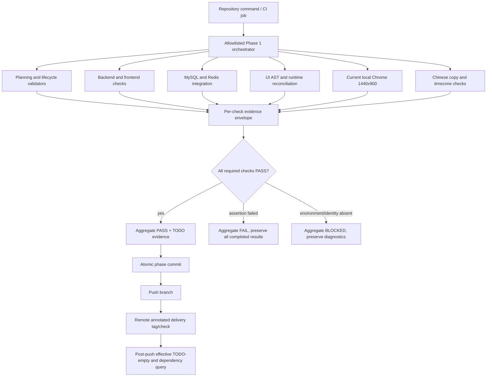

# Phase 1: Engineering verification and drift-control foundation - Research

**Researched:** 2026-08-30
**Domain:** Repository verification trust root, evidence integrity, UI-contract drift, current-local-Google-Chrome compatibility, and atomic delivery attestation
**Confidence:** HIGH for repository state and locked contracts; implementation and independent review of the revised local-Chrome Gate D remain blocked

## Scope supersession notice

DR-01-016 and DR-01-017 supersede every browser-specific recommendation below that mentions Chrome for Testing, ChromeDriver, official browser archives, `chrome-151`/`chrome-152`, current/previous majors, two viewports, four cells, source admission/probes/attestation, provider, tunnel, secret, remote host, or VM. Those passages are retained only as historical research and must not act as bootstrap, lifecycle, tested-subject, TEST-MATRIX, plan, or completion requirements. The current entry contract uses standard-library Ruby against `/Applications/Google Chrome.app/Contents/MacOS/Google Chrome`, probes its execution-time brand/full/major version, launches a synthetic local page with Chrome's own headless fixed argv and isolated profile, and records `EVIDENCE/local-chrome-entry.json`. It has no Playwright dependency. Only an independent four-column ENTRY PASS plus a zero-exit bootstrap over all 13 plans authorizes downstream work. Plan 06 separately launches the same installed Chrome through Playwright at 1440x900 and records `EVIDENCE/local-chrome-runtime.json` plus `/login` smoke/visual evidence. Missing path, non-Google brand, or either launch failure is BLOCKED. The observed version `151.0.7922.174` is not pinned.

<user_constraints>
## User Constraints (from CONTEXT.md)

### Locked Decisions

- D-01: The verified scoped TODO set is the only completion signal; schedules and percentage estimates are forbidden.
- D-02: All validators fail closed on missing, contradictory, stale, unexecuted, or malformed evidence.
- D-03: Phase 1 owns bidirectional route/manifest/DOM/test-ID/Playwright drift checking and the semantic repeated-row selector law.
- D-04: Browser acceptance uses only the current standard-path local Google Chrome. Evidence identifies execution-time brand/full/major version, canonical executable, 1440x900 viewport, Playwright launch, command, result, and artifacts; no browser or driver is downloaded.
- D-05: Phase 1 changes no business schema and contains no Flyway migration.
- D-06: Phase output is human-readable at the terminal and machine-readable under the phase `EVIDENCE/` directory.
- D-07: Phase 1 owns reusable copy/export and timezone verifier contracts; Phase 56 owns their product acceptance.
- D-08: Edge, Safari, Firefox, Internet Explorer, Chromium, and all non-Chrome browsers are unsupported. Use only the standard-path installed Google Chrome with no download, ChromeDriver, provider, tunnel, browser secret, or VM, and add no unsupported-browser blocking UI.

### The agent's discretion

- Internal Ruby, Node, shell, JSON schema, fixture layout, and CI job decomposition may follow repository conventions as long as every locked decision and atomic obligation remains executable.

### Deferred Ideas (OUT OF SCOPE)

- Phase 2 owns the complete Admin/Tenant prototype and UI registry content.
- Later production UI phases own React behavior and obligation-linked browser tests for their business surfaces.
- Phases 51-56 own final assurance across security, capacity, reliability, observability, extensions, and release composition.
</user_constraints>

<phase_requirements>
## Phase Requirements

| ID | Description | Research Support |
| --- | --- | --- |
| OBL-FOUND-TRACE-001 | Missing owner, behavior, test, or evidence fields must fail closed. | Use a table-driven mutation suite over the nine-field catalog and assert stable error IDs plus exact affected obligation/line. [VERIFIED: `.planning/PRD-OBLIGATIONS.md`; `.planning/tools/validate-prd-obligations.rb`] |
| OBL-FOUND-TRACE-002 | Bidirectional orphan and duplicate ownership diagnostics must be distinct. | Normalize the requirement↔obligation↔behavior↔test↔evidence graph, compare both directions, and test orphan/duplicate mutations independently. [VERIFIED: `.planning/REQUIREMENTS.md`; `.planning/tools/validate-prd-obligations.rb`] |
| OBL-FOUND-TRACE-003 | Backend, frontend, MySQL, Redis, browser, copy, viewport, and timezone checks need deterministic commands and evidence. | Build one allowlisted orchestrator with per-check evidence envelopes, disposable service containers, and honest `PASS|FAIL|BLOCKED` reduction. [VERIFIED: `01-SPEC.md`; `DESIGN.md`] |
| OBL-FOUND-TRACE-004 | Artifact, entry, TODO, review, and remote-delivery gates must fail closed. | Extend existing Ruby gates with exit/review/delivery queries and destructive fixture repositories, including an external non-self-referential delivery attestation. [VERIFIED: `.planning/EXECUTION-STANDARD.md`; GitHub issue #13] |
| OBL-FOUND-UI-DRIFT-001 | Missing and stale route/manifest/DOM/test-ID/Playwright references must fail in both directions. | Use TypeScript AST-derived relation sets and executed browser closure, not substring-only scans. [VERIFIED: `.planning/UI-TEST-CONTRACT.md`; current `web/src/router/routes.tsx`] |
| OBL-FOUND-UI-DRIFT-002 | Repeated rows require a semantic selector and a separate non-sensitive key. | Define a versioned row-contract manifest, reject data-derived test IDs, and verify runtime DOM attributes with synthetic keys. [VERIFIED: `DR-01-003`; `.planning/UI-TEST-CONTRACT.md`] |
| OBL-NFR-BROWSER | The current standard-path local Google Chrome requires one real smoke/visual execution at 1440x900. | Probe path/version/brand/Playwright launch at execution time, run LOGIN-SMOKE-V1 once, retain complete visual/runtime evidence, and return BLOCKED for missing/non-Google/unlaunchable Chrome. [CITED: https://playwright.dev/docs/browsers] |
</phase_requirements>

## Summary

Phase 1 must be planned as a verification product, not as a collection of CI commands. The repository already has strong standard-library Ruby foundations for catalog, phase-entry, schema, design/production UI, checksum, Playwright-block, and destructive-fixture validation. The former CfT Attempt 3 evidence is superseded. Current entry is BLOCKED for every plan except `01-00`, which must implement the no-Playwright standard-path entry probe, obtain an independent reviewer PASS, clear the revised plan check, and make the real 13-plan bootstrap pass under DR-01-016 and DR-01-017.

The implementation should add a versioned evidence protocol and an allowlisted orchestrator that never collapses `BLOCKED` into `PASS`, then close three independent trust loops: planning/lifecycle trace, UI relation drift, and environment execution. Each check writes its own result before aggregation; destructive fixtures mutate exactly one invariant and assert both nonzero status and a stable diagnostic identifier. [VERIFIED: locked decisions D-01 through D-06; `DESIGN.md`]

Chrome runtime honesty and atomic delivery are the two planning-critical boundaries. Playwright can launch the installed Google Chrome directly; path/version/brand and a successful launch must come from the actual run. No historical source package is needed. A commit also cannot contain its own final object ID because that ID hashes the commit contents. Use a post-push annotated delivery tag/check that points at the atomic phase commit, and change dependency validation to resolve that indirection instead of demanding a literal self-SHA inside `SUMMARY.md`. [CITED: https://playwright.dev/docs/browsers] [CITED: https://git-scm.com/docs/gitdatamodel.html]

**Primary recommendation:** Execute only Plan 00 while entry is blocked, replace the obsolete entry source chain with a no-Playwright standard-path probe, require independent review and the 13-plan bootstrap, then resume Plan 05 inside its bounded 14-file ownership. Plan 05 supplies the `/login` contract; Plan 06 separately records and validates one 1440x900 local-Chrome runtime/smoke result. Existing evidence-kernel, lifecycle, delivery, UI-drift, and service/timezone outputs are regression-checked later rather than reimplemented. Delivery, row-key, evidence-retention, and Jarvis-trigger decisions remain unchanged.

## Architectural Responsibility Map

| Capability | Primary Tier | Secondary Tier | Rationale |
| --- | --- | --- | --- |
| Obligation and lifecycle validation | Repository tooling | Git remote | Standard-library Ruby owns file/trace/TODO/review contracts; remote state is consulted only for delivery truth. [VERIFIED: `.planning/tools/`] |
| Evidence orchestration | Repository tooling | CI | A root command owns status reduction and JSON output; CI invokes the same command without embedding business logic in YAML. [VERIFIED: `DESIGN.md`] |
| Route/manifest/DOM/test-ID drift | Browser / Client tooling | Repository tooling | TypeScript AST and browser execution know React/Playwright syntax; Ruby phase gates consume normalized results. [VERIFIED: `.planning/UI-TEST-CONTRACT.md`] |
| Repeated-row selector policy | Browser / Client tooling | UI manifest | DOM attributes prove runtime shape; manifest metadata proves key semantics/sensitivity policy. [VERIFIED: DR-01-003] |
| MySQL verification | Database / Storage | API / Backend | A real MySQL service proves dialect, migration, session timezone, and queries; the Spring application proves integration. [VERIFIED: `core/pom.xml`; `application-dev.yml`] |
| Redis verification | Database / Storage | API / Backend | Redis readiness plus write/TTL/read/delete proves the dependency; a Spring integration test proves application wiring. [VERIFIED: `core/pom.xml`; `FrequencyChecker.java`] |
| Google Chrome compatibility | Browser / Client tooling | Standard local application | The repository owns a fixed-path probe, Playwright runner, and evidence validator for the already installed Google Chrome; execution-time path/version/brand/launch establish runtime identity. [CITED: https://playwright.dev/docs/browsers] |
| Chinese-copy validation | Browser / Client tooling | Repository tooling | AST/runtime/export surfaces produce copy; a reviewed registry and allowlist define accepted first-release text. [VERIFIED: `docs/PRD.md` §6.3] |
| UTC+8 and zone identity | API / Backend | Database / Browser | Backend defines temporal serialization and storage semantics; MySQL session and browser display are separately verified. [VERIFIED: `docs/PRD.md` §6.3] |
| Remote delivery attestation | Git remote | Repository tooling | The remote ref/tag is the authority for visibility; the validator resolves and compares it to the phase commit. [CITED: https://git-scm.com/docs/git-ls-remote.html] |

## Project Constraints (from AGENTS.md)

- Target Java 21 and run backend checks with `mvn -f core/pom.xml test`. [VERIFIED: `AGENTS.md`]
- Target Node.js 20 or newer and run `npm --prefix web ci`, `npm --prefix web test`, and `npm --prefix web run build`. [VERIFIED: `AGENTS.md`]
- Deliver through a branch and pull request; never push implementation commits directly to `main`. [VERIFIED: `AGENTS.md`]
- Scope work to GitHub issue #13, update tests for behavior changes, and record every verification boundary that cannot execute. [VERIFIED: `AGENTS.md`; GitHub issue #13]
- Do not copy code, credentials, configuration, test data, or private documentation from internal/non-public repositories. [VERIFIED: `AGENTS.md`]
- Never commit secrets, production data, local runtime state, generated build output, or agent credentials. [VERIFIED: `AGENTS.md`]
- README, roadmap, state, and completion claims must remain evidence-based; a fixture, prototype, mock, or unverified integration is not complete. [VERIFIED: `AGENTS.md`]
- Jarvis work requires an explicit `@jarvis` or `/jarvis` comment by an allowed user; the issue is scope and the PR is the review/merge boundary. The PR body must include issue reference, verification commands, and known limitations. [VERIFIED: `AGENTS.md`]

## Current-State Findings

### Existing assets to preserve

- The nine-field catalog validator proves 522 rows, 108 requirement groups, 56 owners, global obligation/test/evidence uniqueness, valid UI references, and—after DR-01-008 ownership correction—exactly seven Phase 1 owned rows. [VERIFIED: catalog query]
- `test-planning-validators.rb` already covers positive design/production UI and phase-entry fixtures plus destructive cases for missing artifacts, foreign obligations, placeholders, atomic trace mismatch, TODO state, dependency state, fake sources, dead locators, execution checksums, and schema conflicts. [VERIFIED: `.planning/tools/test-planning-validators.rb`; passing execution]
- `validate-ui-contract.rb` already checksum-binds sources, restricts production source paths, requires exact IDs in Playwright blocks, and rejects missing route navigation or action/assertion. Phase 1 should extend rather than replace these contracts. [VERIFIED: `.planning/tools/validate-ui-contract.rb`; `planning-validator-support.rb`]
- Current CI runs only Maven unit tests and npm install/unit/build. It has no MySQL, Redis, Playwright, real-Google-Chrome, copy, timezone, evidence-schema, or phase-gate lane. [VERIFIED: `.github/workflows/ci.yml`]
- Current frontend has React Router object routes but no Playwright dependency/configuration, UI manifest, production E2E scripts, or `data-testid` use in `web/src`. [VERIFIED: `web/package.json`; `web/src/router/routes.tsx`; repository search]
- Current backend tests use H2 with Flyway disabled; they do not prove the MySQL migration or Redis integration. [VERIFIED: `core/src/test/resources/application-test.yml`]
- Current code mixes `LocalDateTime.now()` with `Instant.now()`, while only the dev JDBC URL declares `serverTimezone=Asia/Shanghai`; this is not yet host-independent UTC+8 evidence. [VERIFIED: repository search in `core/src/main`; `application-dev.yml`]

### Entry status

- The Phase 1 catalog query and validator self-tests pass. [VERIFIED: executed commands listed in Validation Architecture]
- The real Phase 1 bootstrap exits nonzero only because the entry review verdict remains `BLOCKER`; plan structure and the exact seven-obligation artifact trace are present. [VERIFIED: real bootstrap output on 2026-08-30]
- GitHub issue #13 has the corrected exact-seven scope and explicit allowed-user `/jarvis` execution trigger required by AGENTS.md. [VERIFIED: https://github.com/Stanley-Zheong/ycsopen-sms/issues/13#issuecomment-5466863741]

## Standard Stack

### Core

| Library/tool | Version | Purpose | Why Standard |
| --- | --- | --- | --- |
| Java / Maven / Spring Boot | Java 21; Spring Boot 3.3.4 | Existing backend and real MySQL/Redis integration checks | Locked by repository contract and current POM; no backend framework change belongs in Phase 1. [VERIFIED: `AGENTS.md`; `core/pom.xml`] |
| Node.js / TypeScript | Node 20+; TypeScript 5.6.2 | UI AST analysis, browser config, evidence utilities | Matches repository runtime and existing compiler dependency. [VERIFIED: `AGENTS.md`; `web/package.json`] |
| Standard-library Ruby | Repository scripts; host Ruby 4.0.5 observed | Catalog, phase, TODO, review, schema, and delivery gates | Existing validators use only standard library modules and already have destructive fixtures. [VERIFIED: `.planning/tools/*.rb`; environment probe] |
| `@playwright/test` | 1.62.1 | Production locator execution against explicit Google Chrome executables, screenshots/traces | Official Playwright docs support executable/channel launch and the registry/package legitimacy checks passed. Bundled Chromium remains diagnostic only. [VERIFIED: npm registry + package-legitimacy seam] [CITED: https://playwright.dev/docs/browsers] |
| MySQL official image | 8.4.11, pinned to resolved digest in CI | Real dialect, Flyway, SQL, and timezone session verification | MySQL 8.4 is the LTS track and the official image publishes 8.4.11. [CITED: https://dev.mysql.com/doc/refman/8.4/en/mysql-releases.html] [CITED: https://hub.docker.com/_/mysql/] |
| Redis official image | 8.4.5, pinned to resolved digest in CI | Real cache connectivity, TTL, and Spring integration verification | The official image and Redis release notes publish 8.4.5; pinning avoids moving-tag evidence. [CITED: https://hub.docker.com/_/redis] [CITED: https://redis.io/docs/latest/operate/oss_and_stack/stack-with-enterprise/release-notes/redisce/redisos-8.4-release-notes/] |
| Git native refs and annotated tag | Git 2.50 observed locally; portable porcelain commands | Remote branch visibility and non-self-referential delivery attestation | `git ls-remote` exposes remote refs and commit IDs without trusting local tracking state. [VERIFIED: environment probe] [CITED: https://git-scm.com/docs/git-ls-remote.html] |

### Supporting

| Tool/source | Version or identity | Purpose | When to Use |
| --- | --- | --- | --- |
| TypeScript Compiler API | Same 5.6.2 package already installed | Parse React routes, JSX attributes, and Playwright calls without regex/string false positives | UI drift static analysis. [VERIFIED: `web/package.json`] |
| Standard macOS Google Chrome path | Local application | Probe the installed execution-time version and launch it through Playwright | No network source or version selection; runtime evidence identifies the executed binary. |
| GitHub service containers | Linux hosted runner | Disposable MySQL/Redis dependencies and health checks | CI integration lane; functional assertions must follow readiness probes. [CITED: https://docs.github.com/en/actions/tutorials/use-containerized-services/create-redis-service-containers] |

### Alternatives Considered

| Instead of | Could Use | Tradeoff |
| --- | --- | --- |
| AST relation extraction | Regex/grep scans | Regex is smaller but current tests already demonstrate comment/string/dead-source false-positive risks; do not use it as the trust root. [VERIFIED: `.planning/tools/test-planning-validators.rb`] |
| Standard-path installed Google Chrome | Any bundled or downloaded browser | The user selected the existing local browser; another binary cannot close the obligation. [CITED: https://playwright.dev/docs/browsers] |
| External annotated delivery tag | Literal commit SHA inside the same commit | A literal self-SHA is content-addressing self-reference and cannot be made a truthful same-commit field. [CITED: https://git-scm.com/docs/gitdatamodel.html] |
| Real MySQL/Redis integration | H2 and mocks | H2/mocks keep unit feedback fast but cannot prove MySQL dialect/Flyway/session timezone or Redis TTL/application wiring. [VERIFIED: `application-test.yml`; `core/pom.xml`] |

**Installation:**

```bash
npm --prefix web install --save-dev @playwright/test@1.62.1
npm --prefix web exec playwright install chromium
```

The implementation must regenerate `web/package-lock.json` from the current branch; it must not copy the divergent candidate branch's lockfile. The local Chrome path/version/brand/launch probe is a separate code-owned runtime step and must not be hidden inside package installation. [VERIFIED: `origin/feature/4-web-test-cases` diff; Playwright official docs]

## Package Legitimacy Audit

| Package | Registry | Age | Downloads | Source Repo | Verdict | Disposition |
| --- | --- | --- | --- | --- | --- | --- |
| `@playwright/test` | npm | Created 2020-09-24; current 1.62.1 modified 2026-08-29 | 58,207,547 weekly at audit | `github.com/microsoft/playwright` | OK; no `postinstall` script returned | Approved and pinned to 1.62.1. [VERIFIED: npm registry + package-legitimacy seam + official Playwright docs] |

**Packages removed due to SLOP verdict:** none. [VERIFIED: package-legitimacy seam]

**Packages flagged as suspicious:** none. [VERIFIED: package-legitimacy seam]

## Architecture Patterns

### System Architecture Diagram



The status reducer is `PASS` only when every required child is `PASS`; any `FAIL` dominates, otherwise any `BLOCKED` blocks completion. Ordering, error identifiers, and result logic are deterministic even though timestamps and run IDs differ between runs. [VERIFIED: `DESIGN.md` state machine]

### Recommended Project Structure

```text
scripts/
├── verify-phase-01                         # repository-root public entry
└── lib/phase-01/                           # allowlisted orchestration/evidence helpers
.planning/tools/
├── validate-phase-lifecycle.rb             # entry/exit/review/effective-TODO checks
├── test-phase-lifecycle.rb                 # positive + one-mutation destructive fixtures
├── validate-verification-evidence.rb       # envelope/schema/status/checksum verifier
└── validate-delivery-attestation.rb        # remote branch + annotated-tag resolution
web/
├── playwright.config.ts                    # structural/current-brand Playwright projects
├── scripts/validate-ui-drift.mjs           # TypeScript-AST relation builder/comparator
├── scripts/test-ui-drift-validator.mjs      # table-driven destructive fixtures
├── verification/ui-manifest.json           # versioned route/page/selector/row relations
└── test/phase01/                            # structural, copy, timezone, browser smoke specs
.planning/phases/01-engineering-verification-foundation/EVIDENCE/
├── schema/                                  # evidence and browser-matrix schemas
├── fixtures/                                # minimal non-sensitive fixture definitions
├── runs/<run-id>/                           # immutable per-check outputs
└── OBL-*.json                               # small obligation summaries/checksums
.github/workflows/ci.yml                     # invokes repository commands; uploads diagnostics
```

All generated reports larger than the small obligation summaries remain CI artifacts rather than committed build output. Committed evidence contains no credentials, production payloads, full phone numbers, message bodies, or local absolute paths. [VERIFIED: `AGENTS.md`; `DESIGN.md`]

### Pattern 1: Versioned evidence envelope

**What:** Every child check writes a schema-versioned JSON envelope before aggregation. [VERIFIED: `DESIGN.md`]

**Required fields:** `schema_version`, `run_id`, `phase`, `obligation_ids`, `case_ids`, `check_id`, `layer`, `argv` as an array, repository-relative `cwd`, `subject_manifest_path`, `subject_manifest_digest`, `tested_subject_digest`, UTC start/end timestamps, sanitized environment identity, `PASS|FAIL|BLOCKED`, nullable exit code, stable error IDs, diagnostics summary, and artifact path/SHA-256/media type. The canonical manifest is a stable path-sorted set of repository-relative path/file-mode/SHA-256/role entries covering tested implementation, tests, configs, contracts, and validators. [VERIFIED: `DESIGN.md`; DR-01-011]

**Rules:**

- Write to a fresh run directory or a temporary file followed by atomic rename; never overwrite an earlier failed run. [VERIFIED: `DESIGN.md`]
- Never accept a producer-supplied `PASS` without independently checking exit status, schema, required artifacts, checksums, code-owned subject membership, file modes, `subject_manifest_digest`, and `tested_subject_digest`. [VERIFIED: D-02; DR-01-011]
- Exclude only the subject manifest itself, generated evidence summaries/artifacts, TODO/SUMMARY, review records, and delivery metadata through schema/code-owned rules; producer-controlled JSON cannot hide a source, test, config, contract, or validator. [VERIFIED: DR-01-011]
- Do not serialize the full process environment or command-line secrets. Store named non-secret identity fields and redact diagnostics before hashing/upload. [VERIFIED: `AGENTS.md`; `DESIGN.md`]
- Preserve completed child envelopes when a later child fails, blocks, times out, or is interrupted. A stale `running` envelope is non-PASS. [VERIFIED: engineering-verification-foundation-06]

### Pattern 2: Table-driven destructive fixtures

**What:** Start from one known-good minimal fixture and apply one named mutation per case. [VERIFIED: existing fixture style in `.planning/tools/test-planning-validators.rb`]

**Per mutation assert:** nonzero exit, exact stable error ID, exact affected obligation/file/line or relation, an emitted evidence envelope, and no conversion to `PASS`. Restore the baseline before the next mutation so one fixture cannot mask another. [VERIFIED: existing `run_validator` pattern; expanded Phase 1 requirement]

**Minimum mutation families:**

1. Catalog: wrong field count; missing owner/behavior/test/evidence; unknown requirement/owner; duplicate obligation/test/evidence; orphan in both graph directions. [VERIFIED: OBL-FOUND-TRACE-001/002]
2. Lifecycle: missing artifact/plan task field/evidence; malformed review; unresolved BLOCKER/HIGH; prechecked entry TODO; open exit TODO; stale or mismatched commit; absent remote ref/tag. [VERIFIED: OBL-FOUND-TRACE-004]
3. Orchestrator: missing executable/service/browser; child nonzero; timeout; malformed JSON; missing checksum artifact; child result for a wrong/stale tested subject; missing/extra input; content/mode mismatch; illegal exclusion; interrupted write. [VERIFIED: engineering-verification-foundation-03/06; DR-01-011]
4. UI: route/page/selector missing and stale in every direction; duplicate tuple; comment/string-only fake; prefix collision; nonliteral route; dead component; dead locator; route without runtime selector closure. [VERIFIED: OBL-FOUND-UI-DRIFT-001; existing negative fixtures]
5. Rows: template-literal/data-derived test ID; phone/database ID/localized label in selector; absent row metadata; absent separate key attribute; sensitive/mutable key classification. [VERIFIED: OBL-FOUND-UI-DRIFT-002]
6. Browser: engine relabelled as brand; version outside frozen matrix; wrong viewport; missing screenshot/report; user-agent-only identity; duplicate cell; one unavailable cell with otherwise green cells. [VERIFIED: OBL-NFR-BROWSER; D-04]

Production command registries must be code-owned/allowlisted; destructive fixtures may inject test doubles only through an explicit test-only interface. Do not execute arbitrary command strings from a mutable JSON manifest. [CITED: https://owasp.org/www-project-application-security-verification-standard/]

### Pattern 3: Bidirectional UI relation graph

**What:** Compare normalized relations, not independent substring sets. [VERIFIED: `.planning/UI-TEST-CONTRACT.md`]

The canonical relations are:

```text
page-id ↔ full route ↔ routed component ↔ rendered data-testid
full route ↔ Playwright test block ↔ data-testid action/assertion
semantic row data-testid ↔ row-contract metadata ↔ separate data-row-key
obligation ↔ behavior ↔ catalog test ↔ case ↔ Playwright ID ↔ evidence
```

Use the TypeScript Compiler API to resolve current nested `createBrowserRouter` object routes, concatenate parent/child paths, identify the routed component, parse actual JSX `data-testid` attributes, and parse literal `test`/`it`, `page.goto`, and `getByTestId` calls. Unknown computed routes or dynamic test IDs fail with a stable unsupported-syntax error until a reviewed adapter is added. [VERIFIED: current `web/src/router/routes.tsx`; TypeScript dependency]

The manifest should store page-scoped route/selector relations and a separate row contract, not only global arrays. Static AST proof is necessary but insufficient: an executed Playwright block must close the route→rendered-selector chain for production evidence. [VERIFIED: `.planning/UI-TEST-CONTRACT.md`; existing production UI validator]

For repeated rows, keep a constant semantic selector such as `tenant-accounts-list-table-row` and expose an independent `data-row-key` whose manifest metadata declares a stable, non-sensitive domain key. Tests locate the semantic row first and then filter by a synthetic row key; the test ID itself never contains the value. [VERIFIED: DR-01-003]

### Pattern 4: Honest single local-Chrome execution

At run start, resolve the exact standard path, execute fixed argv `--version`, require the Google Chrome brand/full version, derive its major, and launch the same executable through Playwright at 1440x900. Record those facts in `EVIDENCE/local-chrome-runtime.json`; do not compare the version to a pinned value. [CITED: https://playwright.dev/docs/browsers]

The single result records path, brand, full/major version, viewport, command/session identity, launch result, screenshot, DOM/ancestor/hit-test observations, console/page errors, browser network transcript, scenario/rule linkage, and artifact checksums. A project name or user-agent string alone is rejected. No browser/driver download, version pair, viewport matrix, or other-browser lane exists.

### Pattern 5: MySQL and Redis evidence

Use pinned, disposable service containers with no persistent volumes and test-only credentials. CI readiness checks only start the test; they are not the evidence conclusion. [CITED: https://docs.github.com/en/actions/tutorials/use-containerized-services/create-redis-service-containers]

**MySQL proof must include:** authenticated `SELECT 1`; server/version identity; Flyway applying the real `V1__init_schema.sql`; expected `flyway_schema_history` row/checksum; application startup against MySQL; one transactional repository round trip; UTF-8/Chinese round trip; and `@@session.time_zone`/temporal round trip. `mysqladmin ping` alone is insufficient because its documented success status can also mean access was denied. [VERIFIED: `core/src/main/resources/db/migration/V1__init_schema.sql`; `core/pom.xml`] [CITED: https://dev.mysql.com/doc/refman/8.0/en/mysqladmin.html]

**Redis proof must include:** authenticated/isolated connection identity where configured; `PING`; random synthetic prefix `SET`; TTL assignment; `GET`; TTL assertion; deletion; and one Spring `StringRedisTemplate` path. Never use `FLUSHALL`, production keys, or an exposed unauthenticated host port. [VERIFIED: `FrequencyChecker.java`] [CITED: https://redis.io/docs/latest/develop/tools/cli/]

### Pattern 6: Chinese-copy and timezone gates

Create a versioned first-release copy registry containing approved simplified-Chinese UI literals, error messages, and export headers plus a narrow reviewed technical-token allowlist. AST scanning covers JSX text and user-visible attributes; runtime scanning covers rendered DOM/ARIA; export fixtures cover generated headers/content. A mock export or the absence of an export feature cannot be labelled executed product evidence. [VERIFIED: `docs/PRD.md` §6.3; `AGENTS.md`]

For time, make `Asia/Shanghai` an explicit application/domain policy rather than relying on the host clock. Verify the JVM/application zone, JDBC/MySQL session zone, stored round trip, API offset/instant, and browser display under a deliberately different browser timezone. International synthetic fixtures must retain an IANA zone ID in addition to an instant/offset so identity survives round trips. [VERIFIED: `docs/PRD.md` §6.3; current `LocalDateTime.now()` and `Instant.now()` mixture]

Because Phase 1 forbids business-schema migrations, any international-message persistence field that does not yet exist cannot be implemented here. The entry decision must define whether Phase 1 closes the validator/fixture contract and later business owners close production persistence, or whether the obligation wording is narrowed/reassigned. [VERIFIED: D-05; current schema inspection]

### Pattern 7: Non-self-referential atomic delivery

A Git commit ID hashes the commit object's contents, including its tree and message; amending `SUMMARY.md` with that ID creates a different commit ID. Requiring the same commit to contain its own literal final SHA is therefore not an executable contract. [CITED: https://git-scm.com/docs/gitdatamodel.html]

Use this machine-verifiable protocol after the project records it in `DECISIONS.md`:

1. `SUMMARY.md` inside the atomic phase commit records the configured remote URL, full branch ref, and a deterministic delivery-ref locator such as `refs/tags/phase-delivery/01`; it does not claim a literal self-SHA. [RECOMMENDED]
2. The pre-push gate proves all non-delivery obligations/reviews/evidence and leaves one reserved external-delivery TODO pending; it emits a content/checksum manifest. [RECOMMENDED]
3. Push the single atomic phase commit to the branch, then verify the branch ref with `git ls-remote --exit-code --heads`. [CITED: https://git-scm.com/docs/git-ls-remote.html]
4. Create and push an annotated tag object at the declared delivery ref, targeted at the exact phase commit. The tag message records phase, remote, branch ref, commit tree, manifest digest, verification result, and CI/PR locator. This adds a tag object, not a second implementation commit. [RECOMMENDED]
5. The post-push validator fetches/resolves the annotated tag and branch, requires both to target the same commit, validates the tag payload, and computes an **effective** scoped TODO result in which only the reserved delivery item is closed by that external attestation. [RECOMMENDED]
6. Future phase dependency validation uses the same remote resolution instead of the current `SUMMARY.md` literal-40-hex regex. [VERIFIED: current `validate_dependency_evidence` literal SHA check]

If the project insists that `SUMMARY.md` contain the literal final SHA and that the same commit already record its own verified remote visibility, the requirement is unsatisfiable. A project decision changing the contract to indirection/external attestation is mandatory before entry. [CITED: https://git-scm.com/docs/gitdatamodel.html]

## File-Level Implementation Guidance

| File | Required implementation | Verification focus |
| --- | --- | --- |
| `scripts/verify-phase-01` | Small POSIX entry that resolves repo root, validates arguments, invokes an allowlisted orchestrator, and returns aggregate status unchanged. | Unknown flag, missing tool, child failure, and blocked dependency all return nonzero with evidence. [VERIFIED: D-02/D-06] |
| `scripts/lib/phase-01/*` | Evidence envelope, child-process capture, atomic write, stable ordering, redaction, checksum, and status reduction. | Preserve earlier child results after later fail/block/interrupt. [VERIFIED: engineering-verification-foundation-06] |
| `.planning/tools/validate-prd-obligations.rb` | Preserve existing schema checks; add or pair with exact artifact reverse-trace validation rather than weakening global counts. | Missing/extra/duplicate graph edges report exact IDs separately. [VERIFIED: current code] |
| `.planning/tools/test-planning-validators.rb` | Keep existing coverage; avoid turning this large fixture into the sole Phase 1 lifecycle suite. | Regression protection for current design/production gates. [VERIFIED: current code] |
| `.planning/tools/validate-phase-lifecycle.rb` | Implement explicit `entry`, `pre-push-exit`, and `post-push-delivery` stages with review/TODO/evidence semantics. | No stage may infer another stage's success. [RECOMMENDED] |
| `.planning/tools/test-phase-lifecycle.rb` | Build temporary fixture repos and a local bare remote; mutate one lifecycle invariant per case. | Prove local-only SHA, absent remote branch, moved tag, mismatched branch/tag, open TODO, and blocking review rejection. [RECOMMENDED] |
| `.planning/tools/validate-delivery-attestation.rb` | Parse declared remote/ref/tag, resolve via `git ls-remote`, fetch tag safely, and verify annotated payload/target. | Reject arbitrary ref syntax, tag movement, lightweight tag if annotation required, and remote mismatch. [CITED: https://git-scm.com/docs/git-ls-remote.html] |
| `web/scripts/validate-ui-drift.mjs` | Build normalized AST relations from React routes/JSX/Playwright and compare with versioned manifest. | Both missing and stale directions, plus syntax false-positive fixtures. [VERIFIED: OBL-FOUND-UI-DRIFT-001] |
| `web/scripts/test-ui-drift-validator.mjs` | Table-driven valid fixture plus route/page/DOM/locator/row mutations. | Exact stable error IDs and source locations. [VERIFIED: TEST-MATRIX target] |
| `web/verification/ui-manifest.json` | Versioned page/route/component/selector/row relation model; use synthetic fixture identifiers for Phase 1. | Schema version, exact relations, checksums, and no sensitive values. [VERIFIED: `DESIGN.md`] |
| `web/playwright.config.ts` | Separate structural engine projects from branded current-browser projects; emit JSON/JUnit/HTML artifacts under run directory. | Project name is not accepted as browser identity without runtime facts. [CITED: https://playwright.dev/docs/browsers] |
| `core/src/test/**/verification/*` | Real MySQL/Redis/timezone integration tests, isolated from existing H2 unit suite. | Fresh schema, TTL, time-zone independence, no production data. [VERIFIED: current test configuration gap] |
| `.github/workflows/ci.yml` | Add portable validators and integration-service gates; upload diagnostics on failure. | CI downloads no browser and does not claim the user's local Chrome run; local pre-push evidence remains required. [VERIFIED: `AGENTS.md`] |
| Phase `EVIDENCE/schema/*.json` | Version evidence/matrix/attestation schemas. | Unknown schema versions and missing fields fail closed. [VERIFIED: `DESIGN.md`] |

## Safe Reuse Audit: `origin/feature/4-web-test-cases`

The branch is based on an older repository state. A wholesale cherry-pick or branch merge would delete the current `skills/` tree and remove `FieldEncryptorTest.java`; only file-level ideas may be reimplemented against the current branch. [VERIFIED: `git diff origin/main..origin/feature/4-web-test-cases`]

| Candidate | Reuse decision | Reason |
| --- | --- | --- |
| `web/playwright.config.ts` shape | Reimplement selectively | `testDir`, `baseURL`, `webServer`, `forbidOnly`, and CI retries are useful scaffolding, but bundled `chromium` does not prove supported Google Chrome and does not emit Phase 1 evidence envelopes. [VERIFIED: branch file inspection] |
| `@playwright/test` dependency | Reuse concept; install current pinned version on current lockfile | Candidate uses the now-current 1.62.1, but its lockfile comes from the divergent branch. [VERIFIED: npm audit and branch file inspection] |
| CI Playwright install/test step | Reuse as a quick structural lane only | It installs only Chromium and runs only the Vite dev server; no real backend/MySQL/Redis or branded matrix is involved. [VERIFIED: branch CI inspection] |
| Test flow ideas | Reuse as non-authoritative scenario seeds | Login, send, dashboard, tenant, and channel scenarios can inform later business phases, but they are outside Phase 1 business scope. [VERIFIED: branch spec inspection] |
| `page.route(...).fulfill(...)` helpers | Use only in explicitly labelled structural fixtures | Every inspected flow substitutes API responses, so it cannot prove backend integration, persistence, authorization, dispatch, or billing. [VERIFIED: branch `helpers.ts` and specs] |
| Existing selectors/test titles | Do not reuse as contract evidence | Tests use text/role/placeholder selectors and `WEB-*` titles, not the required documented `data-testid`, OBL ID, Case ID, and Playwright ID chain. [VERIFIED: branch spec inspection; `.planning/UI-TEST-CONTRACT.md`] |

## Don't Hand-Roll

| Problem | Don't Build | Use Instead | Why |
| --- | --- | --- | --- |
| TypeScript/JSX parsing | Regex lexer or substring scanner as authority | Existing TypeScript Compiler API | Comments, strings, nested routes, imports, and call syntax create false evidence. [VERIFIED: current destructive tests] |
| Browser brand inference | Project-name or user-agent aliases | Canonical standard path, fixed-argv Google Chrome full version, and successful same-browser Playwright launch | Labels do not establish local Google Chrome identity. [CITED: https://playwright.dev/docs/browsers] |
| MySQL/Redis lifecycle | Long-lived developer services and `sleep` readiness | Pinned disposable CI services with health probes and functional assertions | Avoids local state, race conditions, and false readiness. [CITED: GitHub service-container docs] |
| Evidence hash/JSON escaping | Custom crypto or ad-hoc string JSON | Ruby/Node standard JSON and SHA-256 libraries | Existing standard libraries are deterministic and avoid parser ambiguity. [VERIFIED: current Ruby stack] |
| Git self-SHA | Fixed-point placeholder/amend loop | Remote annotated delivery ref resolved after push | Amending changes the commit object ID. [CITED: https://git-scm.com/docs/gitdatamodel.html] |
| Secret masking | Dump environment then regex-redact | Explicit allowlist of non-secret environment identity fields | Unknown secret formats cannot be reliably removed after capture. [VERIFIED: `AGENTS.md`] |
| Simplified-Chinese proof | “Contains Han characters” heuristic alone | Reviewed copy registry + runtime/export coverage + narrow technical allowlist | Han-script presence does not establish simplified-Chinese policy or output coverage. [VERIFIED: PRD acceptance wording] |

## Common Pitfalls

### Pitfall 1: Green aggregate with skipped dependencies

**What goes wrong:** MySQL, Redis, or a browser is unavailable, but the wrapper exits zero because other checks passed. **Avoidance:** represent absence as `BLOCKED`, persist it, and reduce aggregate to nonzero. **Warning sign:** log text says “skipped” while JSON says `PASS`. [VERIFIED: D-02; engineering-verification-foundation-06]

### Pitfall 2: Byte-for-byte evidence mistaken for deterministic result

**What goes wrong:** timestamps/run IDs make evidence files differ, leading developers either to remove useful identity or to call the system nondeterministic. **Avoidance:** determinism applies to ordered checks, stable error IDs, status logic, and normalized assertions; timestamps remain factual run metadata. [VERIFIED: `DESIGN.md` evidence model]

### Pitfall 3: Set equality without route/render relation

**What goes wrong:** a test ID exists somewhere in React and somewhere in Playwright but is dead on the declared route. **Avoidance:** compare route-component-selector tuples and require executed route→selector closure. [VERIFIED: `.planning/UI-TEST-CONTRACT.md`]

### Pitfall 4: Dynamic row value leaks

**What goes wrong:** phone number, database ID, localized label, or mutable name is embedded in `data-testid`, test title, screenshot name, or evidence. **Avoidance:** constant semantic selector, separately classified non-sensitive row key, and synthetic evidence data. [VERIFIED: DR-01-003; `DESIGN.md`]

### Pitfall 5: Browser engine presented as product brand

**What goes wrong:** bundled Chromium becomes “Google Chrome” in a project name/report label. **Avoidance:** validate actual runtime Google Chrome brand/full version/executable and official source checksums. [CITED: https://playwright.dev/docs/browsers]

### Pitfall 6: Installed version is accidentally pinned

**What goes wrong:** the planning-time Chrome version is treated as a permanent requirement, so a normal browser update blocks or mislabels evidence. **Avoidance:** derive full/major version from the standard executable every run and rerun affected evidence/reviews after an update.

### Pitfall 7: Health probe used as integration proof

**What goes wrong:** `mysqladmin ping`/Redis `PING` passes while credentials, schema, timezone, TTL, or application wiring is wrong. **Avoidance:** readiness first, then functional and application-level assertions. [CITED: https://dev.mysql.com/doc/refman/8.0/en/mysqladmin.html] [CITED: https://redis.io/docs/latest/develop/tools/cli/]

### Pitfall 8: Mock browser flow claimed as backend E2E

**What goes wrong:** `page.route().fulfill()` proves only frontend behavior against a replacement. **Avoidance:** mark it structural/mocked and run acceptance against the real core/MySQL/Redis stack. [VERIFIED: candidate branch inspection; `.planning/UI-TEST-CONTRACT.md`]

### Pitfall 9: Same-commit SHA and post-push TODO causality

**What goes wrong:** documentation claims a remote SHA or remote-visible delivery before the commit exists/push occurs. **Avoidance:** external annotated tag/check plus effective post-push TODO query. [CITED: https://git-scm.com/docs/gitdatamodel.html] [VERIFIED: `AGENTS.md` evidence rule]

### Pitfall 10: Broad compatibility obligation closed by a foundation fixture

**What goes wrong:** a synthetic timezone/export/browser fixture is presented as proof of future business UI, exports, or international-message persistence. **Avoidance:** lock whether Phase 1 owns only the reusable gate or the present product behavior, and preserve later production owners' acceptance responsibility. [VERIFIED: Phase boundary; OBL wording mismatch]

## Code Examples

### Explicit standard-path Google Chrome project

```typescript
// Adapted from: https://playwright.dev/docs/browsers
import { defineConfig } from '@playwright/test';

export default defineConfig({
  projects: [{
    name: 'local-google-chrome',
    use: { channel: 'chrome', viewport: { width: 1440, height: 900 } },
  }],
});
```

The project name is descriptive only; the runtime probe must still prove that `channel: 'chrome'` resolves to the standard installed Google Chrome, record its full version and canonical path, and prove launch. Every other browser is absent from acceptance. [CITED: https://playwright.dev/docs/browsers]

### Remote-ref equality check

```bash
# Source: https://git-scm.com/docs/git-ls-remote.html
local_sha="$(git rev-parse HEAD)"
remote_sha="$(git ls-remote --exit-code --heads origin refs/heads/phase/01-engineering-verification | awk 'NR == 1 { print $1 }')"
test "$local_sha" = "$remote_sha"
```

The production validator must validate the configured ref format and parse exactly one matching line; this snippet illustrates the authoritative comparison rather than the full hardened implementation. [CITED: https://git-scm.com/docs/git-ls-remote.html]

### Redis functional readiness sequence

```bash
# Source pattern: https://redis.io/docs/latest/develop/tools/cli/
redis-cli -h "$REDIS_TEST_HOST" -p "$REDIS_TEST_PORT" PING
redis-cli -h "$REDIS_TEST_HOST" -p "$REDIS_TEST_PORT" SET "phase01:${RUN_ID}" synthetic EX 30
redis-cli -h "$REDIS_TEST_HOST" -p "$REDIS_TEST_PORT" GET "phase01:${RUN_ID}"
redis-cli -h "$REDIS_TEST_HOST" -p "$REDIS_TEST_PORT" TTL "phase01:${RUN_ID}"
redis-cli -h "$REDIS_TEST_HOST" -p "$REDIS_TEST_PORT" DEL "phase01:${RUN_ID}"
```

Credentials must be supplied through the CLI's supported secure environment mechanism, never interpolated into recorded command strings. [CITED: https://redis.io/docs/latest/develop/tools/cli/]

## Validation Architecture

### Test Framework

| Property | Value |
| --- | --- |
| Planning/lifecycle framework | Standard-library Ruby scripts with `Open3`, `Tmpdir`, `FileUtils`, JSON, Digest, and local bare-remote fixtures. [VERIFIED: existing tools] |
| Frontend static framework | Node 20+ with TypeScript 5.6.2 Compiler API. [VERIFIED: project config] |
| Frontend runtime framework | Playwright Test 1.62.1 for the current standard-path local Google Chrome at 1440x900; no downloaded or other-browser lane. [VERIFIED: npm audit] [CITED: Playwright docs] |
| Backend unit framework | Maven/Spring Boot test/JUnit from `spring-boot-starter-test`. [VERIFIED: `core/pom.xml`] |
| Integration dependencies | Pinned MySQL 8.4.11 and Redis 8.4.5 disposable services. [CITED: official image/release docs] |
| Quick run command | `/usr/bin/env ruby .planning/tools/test-planning-validators.rb && /usr/bin/env ruby .planning/tools/test-bootstrap-phase-01.rb` [VERIFIED: commands pass now] |
| Full phase command | `./scripts/verify-phase-01 --all --evidence-dir .planning/phases/01-engineering-verification-foundation/EVIDENCE` [VERIFIED: required by current TEST-MATRIX; file does not yet exist] |

### Phase Requirements → Test Map

| Req ID | Behavior | Test type | Automated command | File exists? |
| --- | --- | --- | --- | --- |
| OBL-FOUND-TRACE-001 | Required field rejection | destructive static | `/usr/bin/env ruby .planning/tools/test-planning-validators.rb` | ✅ base coverage; ❌ exact Phase 1 evidence producer gap |
| OBL-FOUND-TRACE-002 | Bidirectional orphan/duplicate distinction | destructive static/graph | `/usr/bin/env ruby .planning/tools/test-planning-validators.rb` | ✅ partial; ❌ full reverse-artifact graph gap |
| OBL-FOUND-TRACE-003 | All repository layers + evidence reduction | integration | `./scripts/verify-phase-01 --all --evidence-dir .../EVIDENCE` | ❌ Wave 0 |
| OBL-FOUND-TRACE-004 | Entry/exit/review/TODO/remote | destructive lifecycle | `/usr/bin/env ruby .planning/tools/test-phase-lifecycle.rb` | ❌ Wave 0 |
| OBL-FOUND-UI-DRIFT-001 | Bidirectional relation drift | AST + browser | `node web/scripts/test-ui-drift-validator.mjs` | ❌ Wave 0 |
| OBL-FOUND-UI-DRIFT-002 | Semantic row/key policy | AST + browser | `node web/scripts/test-ui-drift-validator.mjs` | ❌ Wave 0 |
| OBL-NFR-BROWSER | One real standard-path Google Chrome 1440x900 result | local explicit executable | `npm --prefix web run test:browser:compat` | ❌ local runtime probe, independent review, runner, and evidence pending |

### Sampling Rate

- **Per task commit:** run the focused destructive fixture or focused Maven/Vitest/Playwright test named in that task, then validate its evidence envelope. [VERIFIED: `.planning/EXECUTION-STANDARD.md`]
- **Per wave merge:** run planning validator self-tests, backend/frontend project checks, and every affected integration lane. [VERIFIED: `AGENTS.md`; execution standard]
- **Phase gate:** run all seven exact Phase 1 TEST-MATRIX rows, evidence schema/checksum validation, plan checker, GSD verification/code review, Claude review, effective TODO-empty query, and post-push delivery attestation. [VERIFIED: `TODO.md`; execution standard; DR-01-008]

### Wave 0 Gaps

- [x] Create executable `01-*-PLAN.md` files with complete task structure. [VERIFIED: plan structure queries]
- [ ] Create the evidence envelope/matrix schemas and their invalid-schema/checksum fixtures. [VERIFIED: missing files]
- [ ] Create `scripts/verify-phase-01` and child-result preservation tests. [VERIFIED: missing file]
- [ ] Create lifecycle exit/delivery validators and a local bare-remote destructive suite. [VERIFIED: TEST-MATRIX names a missing command]
- [ ] Install/pin Playwright on the current branch and create config/reporters. [VERIFIED: current `web/package.json`]
- [ ] Create AST UI drift validator, versioned manifest, and all one-mutation fixtures. [VERIFIED: missing files]
- [ ] Create real MySQL/Redis integration profile/tests and CI service lanes. [VERIFIED: current H2-only tests and CI]
- [ ] Create copy registry/scanners and timezone integration fixtures. [VERIFIED: missing files]
- [ ] Implement and independently rerun the repeatable standard-path local-Chrome path/version/brand/1440x900 launch probe. Attempt 3 source artifacts are superseded. [REQUIRED: DR-01-016]
- [ ] Replace the literal-SHA dependency contract with the approved external attestation protocol and test it. [VERIFIED: current validator contradiction]

## Entry Decisions and Unsatisfied Conditions

The planner must not turn these into implementation guesses. Each item requires a recorded decision/evidence before the independent entry review can be `PASS`. [VERIFIED: `.planning/EXECUTION-STANDARD.md` non-runnable checks are blockers]

1. **Authorized issue trigger — RESOLVED:** GitHub issue #13 contains the corrected exact-seven scope and required `/jarvis` execution-scope comment from the allowed user. [VERIFIED: https://github.com/Stanley-Zheong/ycsopen-sms/issues/13#issuecomment-5466863741]
2. **Chrome execution source — BLOCKED pending DR-01-016 implementation:** Probe and launch only `/Applications/Google Chrome.app/Contents/MacOS/Google Chrome`; record execution-time version/brand and independent reviewer rerun. No download or driver is permitted.
3. **Viewport set — RESOLVED by DR-01-016:** Execute one 1440x900 desktop scenario.
4. **Delivery indirection — RESOLVED by DR-01-004:** Use the deterministic annotated external delivery ref/tag and live branch/tag resolution; literal same-commit self-SHA is forbidden.
5. **Compatibility obligation meaning — RESOLVED by DR-01-008:** Phase 1 builds and proves reusable fail-closed copy/export and UTC+8/IANA verifier contracts under OBL-FOUND-TRACE-003. Phase 56 owns OBL-NFR-CHINESE and OBL-NFR-TIMEZONE and must execute them against all production surfaces and international-message persistence. Synthetic Phase 1 fixtures cannot close either product obligation. [VERIFIED: DR-01-008]
6. **Route inventory semantics — RESOLVED by DR-01-006:** Normalize navigable leaves, redirects/indexes, parameter patterns, route-component-selector-test tuples, and fail closed on unsupported dynamic syntax. [VERIFIED: current nested route object]
7. **Row-key policy — RESOLVED by DR-01-003 plus a versioned row-key registry schema:** Phase 1 creates `web/verification/row-key-registry.schema.json` and `row-key-registry.json`; only explicitly registered synthetic/non-sensitive immutable business-key classes pass, while phone number, database ID, localized label, mutable name/value, credential, and message-content classes fail closed. [VERIFIED: DR-01-003]
8. **Evidence retention — RESOLVED by DR-01-007:** Commit redacted JSON/checksum facts; keep screenshots/traces/videos/logs as access-controlled CI artifacts with locator/checksum and synthetic data only.

### Hard impossible/blocked conditions

- Bundled Playwright Chromium cannot satisfy supported Google Chrome evidence. [CITED: https://playwright.dev/docs/browsers]
- A literal final commit SHA cannot truthfully be stored inside that same commit. [CITED: https://git-scm.com/docs/gitdatamodel.html]
- Mocked `page.route().fulfill()` flows cannot prove the real backend/database/cache behavior they replace. [VERIFIED: candidate branch inspection; UI contract]
- Phase 1 cannot add international-message persistence fields while D-05 forbids business schema changes. [VERIFIED: D-05]
- Phase exit cannot be claimed while the standard-path local Google Chrome is missing, non-Google, unlaunchable, or its one 1440x900 scenario is incomplete; `BLOCKED` is required. [VERIFIED: D-02/D-04/D-08]

## Environment Availability

| Dependency | Required By | Available | Version/identity | Fallback |
| --- | --- | --- | --- | --- |
| Java | Backend tests | ✓ | Temurin 21.0.10 | — [VERIFIED: local probe] |
| Maven | Backend tests | ✓ | 3.9.11 | — [VERIFIED: local probe] |
| Node.js/npm | Web tooling | ✓ | Node 24.2.0 / npm 11.3.0; meets 20+ | CI remains explicit Node 20+ [VERIFIED: local probe; AGENTS.md] |
| Ruby | Planning validators | ✓ | 4.0.5 | `/usr/bin/env ruby` repository convention [VERIFIED: local probe] |
| Docker daemon | MySQL/Redis fixtures | ✓ | Docker Desktop server 28.1.1, arm64 | GitHub Linux service containers [VERIFIED: local probe] |
| MySQL CLI | Diagnostics | ✓ | 9.3.0 client | Execute client inside pinned service container [VERIFIED: local probe] |
| Redis CLI | Diagnostics | ✗ | Missing locally | Execute `redis-cli` inside the pinned Redis service container; no host install required. [VERIFIED: local probe] |
| Google Chrome | One supported 1440x900 local run | Revised Gate D and Plan 06 pending implementation | Standard path currently reports `151.0.7922.174`; this value is observed, not pinned | Probe path/version/brand/launch, obtain independent review, then execute the single scenario. [REQUIRED: DR-01-016] |
| GitHub CLI/auth | Issue/PR/remote queries | ✓ | gh 2.74.2; authenticated | Git native remote commands remain validator authority. [VERIFIED: local probe] |
| Explicit Jarvis issue trigger | Implementation authorization | ✓ | Issue #13 corrected scope and `/jarvis` comment `5466863741` | No fallback required. [VERIFIED: issue #13; AGENTS.md] |

**Gate D evidence status:** BLOCKED. Attempt 3 is superseded. Repository tooling must implement the local-Chrome probe, an independent reviewer must rerun it, the revised plan checker must clear, and the real bootstrap must pass before implementation resumes.

**Missing dependencies with fallback:** local `redis-cli` can be replaced by the CLI inside the disposable Redis container. [VERIFIED: official Redis image/docs]

## Security and Privacy Domain

OWASP ASVS 5.0 is the current stable ASVS release, and its chapter numbering differs from older ASVS 4.x tables. Phase 1 primarily touches ASVS 5 validation/business logic, file handling, API/service, configuration, data protection, secure coding, and security logging categories. [CITED: https://owasp.org/www-project-application-security-verification-standard/] [CITED: https://cornucopia.owasp.org/taxonomy/asvs-5.0]

### Applicable ASVS Areas

| ASVS 5 area | Applies | Phase control |
| --- | --- | --- |
| V2 Validation and Business Logic | yes | Strict schema/version/ref/argument allowlists; malformed or contradictory input fails closed. [VERIFIED: D-02] |
| V4 API and Web Service | yes | Treat official Chrome source metadata and GitHub responses as untrusted external data; validate shape/identity/checksum. [CITED: ASVS 5 taxonomy] |
| V5 File Handling | yes | Repository-relative paths, root containment, regular-file checks, atomic writes, controlled artifact types/sizes. [CITED: ASVS 5 taxonomy] |
| V6 Authentication / V7 Session / V8 Authorization | indirect | No product auth change; protect CI secrets and do not expose them to fork PR jobs. [VERIFIED: phase boundary; AGENTS.md] |
| V11 Cryptography | yes | Use standard SHA-256 for integrity metadata; do not invent signing/encryption. Hashes detect drift but do not by themselves establish publisher trust. [VERIFIED: existing Digest usage] |
| V13 Configuration | yes | Pin runtime/container/Chrome inputs, record configuration identity, and fail on unapproved source or remote. [CITED: ASVS 5 taxonomy] |
| V14 Data Protection | yes | Synthetic data only; no phone/message/credentials in selectors, reports, screenshots, or logs. [VERIFIED: `DESIGN.md`] |
| V15 Secure Coding and Architecture | yes | Allowlisted commands, bounded processes, stable errors, independent evidence validation. [CITED: ASVS 5 taxonomy] |
| V16 Security Logging and Error Handling | yes | Diagnostic evidence is complete, redacted, checksum-bound, and never converted from blocked/fail to pass. [CITED: ASVS 5 taxonomy] |

### Threat and Privacy Risks

| Threat | STRIDE/privacy class | Required mitigation |
| --- | --- | --- |
| Malicious command/ref/path in manifest | Tampering / elevation | Never shell-evaluate manifest command strings; validate argv/ref/path allowlists and repository containment. [CITED: ASVS 5 validation/configuration] |
| Forged `PASS` JSON or stale report | Spoofing / tampering | Recompute code-owned subject membership, path/mode/content hashes, both subject digests, artifact checksums, expected case set, schema version, and child exit status. [VERIFIED: DR-01-011 plus existing production execution validator pattern] |
| Bundled Chromium relabelled as Google Chrome | Spoofing | Cross-check executable identity, full version, OS, browser/driver source checksums, and frozen official matrix. [VERIFIED: D-04] |
| Secrets in diagnostics/artifacts | Information disclosure | Explicit environment-field allowlist and redact before writing; the Chrome source/runner uses no browser secret. [VERIFIED: AGENTS.md; D-08] |
| Phone/message/tenant values in selectors/screenshots | Privacy disclosure | Synthetic fixtures, semantic IDs, non-sensitive row-key registry, screenshot data reset. [VERIFIED: DR-01-003; `DESIGN.md`] |
| Artifact zip/path traversal or oversized reports | Tampering / denial | Do not extract untrusted archives in Phase 1; enforce type/size/path and checksum bounds. [CITED: ASVS 5 file handling] |
| Shared MySQL/Redis local state | Tampering / repudiation | Disposable isolated containers, random run prefix, no persistent volumes, no `FLUSHALL`. [CITED: GitHub service-container docs] |
| Mutable delivery tag/branch | Tampering / repudiation | Protected tag namespace, branch/tag target equality, PR/check locator, and explicit detection of ref movement. [CITED: Git remote-ref docs] |

## State of the Art

| Old approach | Current recommended approach | Change/evidence | Impact |
| --- | --- | --- | --- |
| Grep presence checks | AST relation graph + executed browser closure | Existing validator fixtures already reject comment/string/dead-locator evidence. [VERIFIED: repository tests] | Prevents false completion from dead code. |
| Another browser labelled Google Chrome | Standard-path installed Google Chrome plus runtime path/version/launch identity | Playwright can launch the branded local channel directly. [CITED: Playwright browser docs] | Honest supported-brand evidence. |
| H2-only backend confidence | Unit H2 plus pinned MySQL/Redis integration | Current test profile disables Flyway and uses H2. [VERIFIED: project config] | Proves production dependency semantics without slowing every unit test. |
| Literal remote SHA in committed summary | Annotated post-push delivery ref/tag | Git commit identity is content-addressed. [CITED: Git data model] | Preserves one atomic implementation commit and truthful remote proof. |
| One aggregate log | Per-child envelope + immutable aggregate | Locked design requires preserved diagnostics. [VERIFIED: DESIGN.md] | Failures remain diagnosable and machine-queryable. |

**Deprecated/outdated for this phase:** engine aliases as brands, substring-only production proof, H2 as MySQL evidence, mocked browser tests as backend E2E, moving Docker tags without digest, and same-commit self-SHA claims. [VERIFIED: findings above]

## Assumptions Log

| # | Claim | Section | Risk if Wrong |
| --- | --- | --- | --- |
| — | None. Recommendations not already locked are labelled `[RECOMMENDED]` and are entry decisions, not assumed facts. | All | The planner must not silently lock them without a recorded decision. |

## Open Questions

1. **Which browser execution source is authorized? — RESOLVED AND ATTESTED BY DR-01-013/I-016**
   - Decision: current Google Chrome at the standard local path through Playwright; no download, ChromeDriver, provider, tunnel, secret, remote host, or VM. [VERIFIED: D-08; DR-01-016]
   - Gate D evidence: local path/version/brand/1440x900 launch probe plus independent rerun; currently BLOCKED pending implementation.

2. **Does Phase 1 close compatibility behavior or only its reusable verifier? — RESOLVED by DR-01-008**
   - Decision: Phase 1 owns reusable validators under OBL-FOUND-TRACE-003; Phase 56 owns OBL-NFR-CHINESE and OBL-NFR-TIMEZONE product acceptance. Synthetic contract evidence never closes future production behavior. [VERIFIED: DR-01-008]

3. **Which external delivery attestation is accepted? — RESOLVED by DR-01-004**
   - Decision: use a deterministic protected annotated tag plus live branch/tag target resolution; the tag payload records phase commit/tree, tested-subject/subject-manifest/evidence-manifest digests, branch, PR/check, and PASS without a second implementation commit. The validator recomputes the canonical subject from the target tree. [VERIFIED: DR-01-004; DR-01-011]

4. **What is the allowed semantic row-key registry? — RESOLVED by DR-01-003 plus the versioned registry schema**
   - Decision: `web/verification/row-key-registry.schema.json` requires an explicit reviewed class declaration. Only registered synthetic/non-sensitive immutable business keys are allowed; phone numbers, database IDs, localized labels, mutable values, credentials, and message content are forbidden and covered by destructive fixtures. [VERIFIED: DR-01-003]

## Sources

### Primary (HIGH confidence)

- Repository `AGENTS.md`, Phase 1 SPEC/CONTEXT/DESIGN/DECISIONS/TODO/TEST-MATRIX, ROADMAP, REQUIREMENTS, STATE, EXECUTION-STANDARD, UI-TEST-CONTRACT, PRD catalog, tools, CI, backend/frontend configs, and current sources — implementation reality and locked contracts. [VERIFIED: codebase inspection]
- GitHub issue #13 and `origin/feature/4-web-test-cases` through read-only `gh`/Git inspection — delivery scope and candidate audit. [VERIFIED: GitHub/Git inspection]
- https://playwright.dev/docs/browsers — bundled Chromium versus explicit Google Chrome execution. [CITED]
- https://googlechromelabs.github.io/chrome-for-testing/ — official Chrome version endpoints. [CITED]
- https://git-scm.com/docs/gitdatamodel.html and https://git-scm.com/docs/git-ls-remote.html — content-addressed commits and remote-ref inspection. [CITED]
- https://dev.mysql.com/doc/refman/8.4/en/mysql-releases.html and https://dev.mysql.com/doc/refman/8.0/en/mysqladmin.html — MySQL LTS and readiness semantics. [CITED]
- https://redis.io/docs/latest/develop/tools/cli/ — Redis functional CLI behavior and credential guidance. [CITED]
- https://docs.github.com/en/actions/tutorials/use-containerized-services/create-redis-service-containers — disposable service-container health pattern. [CITED]
- https://owasp.org/www-project-application-security-verification-standard/ and https://cornucopia.owasp.org/taxonomy/asvs-5.0 — current ASVS version/categories. [CITED]

### Secondary (MEDIUM confidence)

- Docker official image catalogs for MySQL 8.4.11 and Redis 8.4.5; implementation must pin resolved image digests and record them in evidence. [CITED: https://hub.docker.com/_/mysql/] [CITED: https://hub.docker.com/_/redis]

### Tertiary (LOW confidence)

- None used as implementation authority.

## Metadata

**Confidence breakdown:**

- Standard stack: HIGH — current repository versions plus official package/image/runtime sources were checked.
- Architecture: HIGH — derived from locked Phase 1 contracts and executable existing validators.
- Browser execution availability: the standard path currently reports Google Chrome `151.0.7922.174`; revised repository probe, independent review, and durable single-run evidence remain pending.
- Pitfalls: HIGH — most have direct destructive-fixture, code, or official protocol evidence.

**Research date:** 2026-08-30

**Revalidation trigger:** Re-run official browser-matrix queries, package legitimacy/version checks, environment probes, issue authorization, and remote-ref checks whenever planning or execution resumes; no schedule or expiry estimate is maintained. [VERIFIED: D-01]
