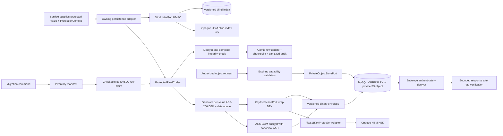

# Phase 3: Cryptographic storage and migration bootstrap - Research

**Researched:** 2026-08-31
**Domain:** Java 21 application-layer envelope encryption, PKCS#11 HSM integration, protected persistence, private object storage, and restartable MySQL migration
**Confidence:** HIGH for the architecture and repository findings; MEDIUM for the unexecuted SoftHSM and MinIO adapter paths

<user_constraints>
## User Constraints (from CONTEXT.md)

### Locked Decisions
- The verified scoped TODO set is the only completion signal.
- The four `crypto-storage-bootstrap` atomic obligations are the authoritative completion units.
- The phase owns only `ycs.sms.crypto-storage-bootstrap.*` schema objects and Flyway versions `V1200-V1299` under expand-migrate-contract rules.
- Master keys must never be stored in application data, source, logs or evidence. Production key access crosses a KMS/HSM adapter boundary; executable tests use a deterministic in-memory adapter without weakening production configuration validation.
- Existing protected plaintext must migrate through a resumable, idempotent, integrity-checked and auditable path with an explicit failure-safe rollback contract.
- Evidence objects must be encrypted at rest and exposed only through time-limited authorized access, never public direct links.
- Password hashing and credential schema remain Phase 5 responsibilities; masked/reveal authorization and privileged audit remain Phase 6 responsibilities.

### the agent's Discretion
- Internal Java package decomposition, ciphertext envelope format, adapter interfaces, migration batch/checkpoint structure, test fixture layout, and verification tooling may follow repository conventions as long as all locked decisions and atomic obligations remain executable and fail closed.

### Deferred Ideas (OUT OF SCOPE)
- Password hashing, authentication and console RBAC are Phase 5.
- Default masking, privileged full reveal, current-RBAC checks and reveal audit are Phase 6.
- Business-module schema adoption of the protected-field boundary occurs in each owning phase.
- Encrypted cold archives, retention and restore are Phase 47.
</user_constraints>

<phase_requirements>
## Phase Requirements

| ID | Description | Research Support |
| --- | --- | --- |
| REQ-NFR-DATA-PROTECTION | Sensitive identity, contact, credential, and financial data is encrypted, masked, key-managed, and access-audited. | This phase implements only the storage/key portion through the envelope format, HSM port, protected persistence/object boundaries, leak scan, and migration controls below; masking/reveal/audit authorization remains Phase 6. [VERIFIED: `.planning/REQUIREMENTS.md`; `03-CONTEXT.md`] |
| OBL-CRYPTO-STORAGE-001 | Protected database fields are encrypted through one data-access boundary. | Use an explicit `ProtectedFieldCodec` behind repository-owned persistence adapters; do not scatter `FieldEncryptor` calls or use a context-free global JPA converter. [VERIFIED: `.planning/PRD-OBLIGATIONS.md`; current JPA mappings] |
| OBL-CRYPTO-STORAGE-002 | Evidence images use encrypted object storage and expiring authorized URLs with no public direct links. | Store application-encrypted bytes through a private S3 port and serve decrypted bytes only through an expiring application capability, never a raw object URL. [CITED: https://docs.aws.amazon.com/AmazonS3/latest/userguide/access-control-block-public-access.html, accessed 2026-08-31] |
| OBL-CRYPTO-STORAGE-003 | Envelope keys are separated, supplied by KMS/HSM, rotatable, recoverable, and never persisted as plaintext master material. | Use an opaque PKCS#11 KEK for production, a deterministic test-only adapter for unit tests, versioned key references, rewrap rotation, and fail-closed recovery. [CITED: https://docs.oracle.com/en/java/javase/21/security/pkcs11-reference-guide1.html, accessed 2026-08-31] |
| OBL-CRYPTO-STORAGE-004 | Existing protected plaintext migrates idempotently with integrity checks and a failure-safe rollback path. | Use a manifest-driven, bounded, checkpointed migration command with row-level verify-before-commit, envelope classification, resumable checkpoints, and forward-fix/restored-snapshot rollback. [VERIFIED: current V1 schema; `.planning/SCHEMA-OWNERSHIP.md`] |
</phase_requirements>

## Summary

The repository already has the correct primitive direction—AES-256-GCM, fresh nonces, authenticated decryption, Flyway, and a real MySQL fixture—but not a production storage boundary. `FieldEncryptor` owns one configuration key directly, emits an unversioned `iv || ciphertext || tag` payload, has no AAD, and cannot identify a key version. More critically, `MessageSubmitService` currently copies a phone number directly into `message_tasks.mobile_encrypted`, while `HashUtil` uses unkeyed SHA-256 for a small, enumerable value space. [VERIFIED: `FieldEncryptor.java`; `FieldEncryptorTest.java`; `MessageSubmitService.java`; `HashUtil.java`]

The recommended architecture keeps cryptographic policy in one backend boundary but does not pretend that a JPA `AttributeConverter` can supply row-bound context. Jakarta's converter contract receives only the attribute or column value, so tenant, field, and immutable record identity must be provided by explicit persistence adapters. Each protected value gets a fresh AES-256 DEK and AES-GCM nonce; the DEK is wrapped by an opaque PKCS#11 KEK through a `KeyProtectionPort`; the self-describing envelope records only algorithm/version/provider/key reference and ciphertext material. A separate HSM-backed HMAC key produces versioned blind indexes. [CITED: https://jakarta.ee/specifications/persistence/3.1/apidocs/jakarta.persistence/jakarta/persistence/attributeconverter, accessed 2026-08-31] [CITED: https://csrc.nist.gov/pubs/sp/800/38/d/final, accessed 2026-08-31]

Phase 3 must stay inside its locked schema boundary. `V1200+` may create only Phase-3 metadata/checkpoint/object records. It must not silently add shadow columns to `legacy.ycsopen.core.*`: the registry would require a cross-owner claim that keeps owner `engineering-verification-foundation`, uses that owner's `V0001-V0999` namespace, and cites a recorded `DR-*` approval. That conflicts with the current locked decision that Phase 3 uses only `V1200-V1299`; therefore the executable default is an in-place data migration over existing V1 protected columns with no legacy DDL. If implementation discovers that legacy DDL is unavoidable, planning must stop and obtain an explicit decision that reconciles those contracts. [VERIFIED: `.planning/SCHEMA-OWNERSHIP.md`; `.planning/EXECUTION-STANDARD.md`; `planning-validator-support.rb`]

**Primary recommendation:** implement a versioned envelope core plus PKCS#11 HSM production adapter, explicit protected persistence adapters, private S3 object port with application-mediated expiring access, manifest-driven MySQL migration, and canary leak scans; accept completion only when all four obligation-linked TODOs are empty with real MySQL/PKCS#11/S3 evidence, not mocks.

## Project Constraints (from AGENTS.md and repository skills)

- Target Java 21 and run backend verification with `mvn -f core/pom.xml test`. [VERIFIED: `AGENTS.md`]
- Work on a scoped branch and deliver through a pull request; no implementation commit goes directly to `main`. [VERIFIED: `AGENTS.md`]
- Behavior changes require tests, and any unexecuted verification boundary must be recorded rather than represented as complete. [VERIFIED: `AGENTS.md`]
- Do not copy non-public YCSAN code/data/configuration or commit secrets, production data, runtime state, generated output, or agent credentials. [VERIFIED: `AGENTS.md`]
- Applied Flyway migrations are immutable; use integer `V<integer>__...sql`, real MySQL verification, and explicit schema ownership/rollback evidence. [VERIFIED: `skills/flyway-migration/SKILL.md`]
- H2 is a unit-test convenience, not MySQL dialect, lock, Flyway, or migration evidence. [VERIFIED: `skills/java-unit-testing/SKILL.md`]
- One semantic owner must control encryption, persistence, object access, migration, and redaction rules; callers adapt but do not redefine them. [VERIFIED: `skills/feature-delivery-guardrails/SKILL.md`]
- Static checks, deterministic adapters, real service adapters, and production-environment proof remain separately labeled. [VERIFIED: `skills/SKILL.md`]
- The phase is non-UI. Pencil, browser work, routes, `data-testid`, and Playwright are not required for these four obligations. [VERIFIED: `ROADMAP.md` Phase 3 primary surfaces and test layers]

## Architectural Responsibility Map

| Capability | Primary Tier | Secondary Tier | Rationale |
| --- | --- | --- | --- |
| Envelope encryption/decryption | API / Backend | HSM boundary | Application policy owns AAD and envelope compatibility; the HSM owns KEK operations. [CITED: https://docs.cloud.google.com/kms/docs/envelope-encryption, accessed 2026-08-31] |
| Protected field write/read | Database / Storage | API / Backend | Repository adapters own persisted representation; business services receive domain values and never key material. [VERIFIED: `03-CONTEXT.md`] |
| Blind equality index | Database / Storage | HSM boundary | The database stores only a versioned HMAC result; the HSM-backed MAC key remains opaque. [CITED: https://docs.oracle.com/en/java/javase/21/security/pkcs11-reference-guide1.html, accessed 2026-08-31] |
| Key lifecycle and rotation | HSM boundary | Database / Storage | HSM keeps KEKs; the database stores only aliases, state, checkpoints, and wrapped DEKs. [CITED: https://cheatsheetseries.owasp.org/cheatsheets/Key_Management_Cheat_Sheet.html, accessed 2026-08-31] |
| Evidence objects | Database / Storage | API / Backend | Private S3-compatible storage holds ciphertext; the backend enforces capability expiry and decrypts only after authorization. [CITED: https://docs.aws.amazon.com/AmazonS3/latest/userguide/access-control-block-public-access.html, accessed 2026-08-31] |
| Plaintext migration | Database / Storage | API / Backend | MySQL supplies bounded transactional row updates; the Java command performs classification, encryption, integrity checks, and checkpointing. [CITED: https://dev.mysql.com/doc/refman/8.4/en/update.html, accessed 2026-08-31] |
| Log redaction and leak scans | API / Backend | Verification tooling | Prevent sensitive arguments at call sites and sanitize at output; scans prove synthetic canaries do not escape. [CITED: https://cheatsheetseries.owasp.org/cheatsheets/Logging_Cheat_Sheet.html, accessed 2026-08-31] |

## Current Repository Evidence

### Confirmed assets

| Evidence | Finding | Planning consequence |
| --- | --- | --- |
| `FieldEncryptor.java` | Uses `AES/GCM/NoPadding`, a fresh 12-byte IV, and a 128-bit tag. [VERIFIED] | Retain the tested JCE primitive behavior, but replace direct configuration-key ownership and unversioned payloads. |
| `FieldEncryptorTest.java` | Covers null, empty/unicode, nonce freshness, tamper, wrong-key, and malformed payload. [VERIFIED] | Preserve these as low-level vectors and add envelope/AAD/key lifecycle/fault cases. |
| `MessageSubmitService.java` | `task.setMobileEncrypted(request.phoneNumber())` persists plaintext. [VERIFIED] | This is the first executable regression target for OBL-CRYPTO-STORAGE-001 and the leak scan. |
| `HashUtil.java` | Uses raw SHA-256 for mobile equality lookup. [VERIFIED] | Replace new writes with HMAC blind indexes and a version byte; retain legacy reads only inside migration compatibility. |
| Entity mappings | `VARBINARY` columns are modeled as `String` in several entities. [VERIFIED] | New protected persistence types must use `byte[]`/immutable value objects and explicit adapters; test actual Connector/J binding. |
| `V1__init_schema.sql` | Contains protected identity/contact/credential fields and object references, but only one migration exists. [VERIFIED] | Build an inventory manifest; never infer coverage from `_encrypted` names alone. |
| `application.yml` | Provides a default placeholder for `FIELD_ENCRYPTION_KEY`. [VERIFIED] | Production startup must reject in-memory/direct-key configuration and remove this property from production wiring. |
| Phase 1 MySQL harness | Runs pinned MySQL 8.4.11 and Flyway against a disposable service. [VERIFIED] | Reuse/refactor it for Phase 3; do not add another unrelated container framework. |
| `Phase01MySqlIntegrationTest` | Asserts the latest Flyway version equals `1`. [VERIFIED] | Change the assertion to require immutable V1 plus the declared current set; otherwise adding V1200 breaks Phase 1 for the wrong reason. |
| Flyway version helper | Reports `NEXT=V2` and has no owner namespace mode. [VERIFIED] | Extend it to select/validate the registered owner range; Phase 3 must produce V1200, not V2. |
| Logging | Only a few explicit log call sites exist, but exception text and throwable rendering are unsanitized. [VERIFIED] | Add prevention rules, output-boundary defense, captured-log tests, and canary scans. |

### Protected-field inventory seed

The implementation must generate the canonical inventory mechanically, but the current V1 seed already includes these classes of targets. [VERIFIED: `V1__init_schema.sql`; `docs/PRD.md` §6.2.1]

| Class | Current columns/references | Required Phase-3 treatment |
| --- | --- | --- |
| Identity/contact | `users.phone_encrypted`; tenant representative/contact ID and phone columns; signature applicant phone/ID; terminal mobile columns in portability, blacklist, message task, bulk item, uplink, unsubscribe | Envelope encryption; HMAC blind index where equality lookup exists; AAD binds tenant/resource/field. |
| Credentials | channel account/password; tenant API secret; tenant protocol account/password | Envelope encryption; never expose to logs/evidence; password hashing itself remains Phase 5. |
| Evidence objects | business license, representative ID images, proof files, export object reference | Store opaque `protected_object_id`, private ciphertext object, and expiring authorized application URL. |
| Financial protected identifiers | No bank account, payment-card, or tax-secret field is currently marked in V1. [VERIFIED] | Register future protected financial identifiers with the same boundary. Do not encrypt arithmetic amount/balance columns in this phase because current SQL semantics require numeric operations and the PRD does not mark those fields `🔒`. |
| Ambiguous candidates | unified social credit code, callback URLs, raw provider payloads, names/addresses, proof URLs not marked `🔒` | Inventory as `REVIEW_REQUIRED`; do not silently classify or exempt. A reviewed manifest entry is required before the leak scan can pass. |

## Standard Stack

### Core

| Library/tool | Version/source | Purpose | Why standard for this phase |
| --- | --- | --- | --- |
| Java JCA/JCE | Java 21.0.10 installed | AES-256-GCM, secure random, HMAC API, constant-time comparison | Uses platform cryptographic providers; no custom primitive. [VERIFIED: local probe] [CITED: https://docs.oracle.com/en/java/javase/21/security/index.html, accessed 2026-08-31] |
| SunPKCS11 | Java 21 module `jdk.crypto.cryptoki` | Production HSM bridge for opaque AES KEK and HMAC key operations | Oracle documents it as a JCA/JCE-to-native-PKCS#11 bridge and lists AES-GCM/HmacSHA256 mechanisms. [CITED: https://docs.oracle.com/en/java/javase/21/security/pkcs11-reference-guide1.html, accessed 2026-08-31] |
| Spring Boot / Data JPA / JDBC | Existing Spring Boot 3.3.4 | Dependency injection, transactions, repository adapters, migration command | Already locked by the repository; no framework replacement is needed. [VERIFIED: `core/pom.xml`] |
| Flyway | Existing Boot-managed Flyway 10.x line | Create Phase-3-owned metadata/checkpoint/object tables | Versioned migrations are ordered, applied once, and checksum validated. [CITED: https://documentation.red-gate.com/fd/versioned-migrations-273973333.html, accessed 2026-08-31] |
| MySQL | Pinned local image `mysql@sha256:b3b90af...`, server 8.4.11 | Real persistence, migration, restart, and lock behavior | Reuses the authoritative Phase 1 harness. [VERIFIED: `service_checks.rb`; Phase 1 evidence] |
| AWS SDK for Java v2 S3 | BOM/modules 2.54.7 | Production S3-compatible object adapter | Official S3 client; current Maven Central release verified directly. [VERIFIED: Maven Central metadata, accessed 2026-08-31] [CITED: https://docs.aws.amazon.com/sdk-for-java/latest/developer-guide/examples-s3.html, accessed 2026-08-31] |
| MinIO server | Existing local image digest `sha256:14cea493...`, release label `RELEASE.2025-09-07T16-13-09Z` | Local real S3-compatible adapter evidence | Exercises network, signing, private bucket, raw ciphertext, and object lifecycle instead of a mock. [VERIFIED: local Docker image inspection] [CITED: https://min.io/docs/minio/linux/administration/identity-access-management.html, accessed 2026-08-31] |
| SoftHSM | Official SoftHSM 2.7.0 source; not installed locally | Local real PKCS#11 provider evidence | Exercises the same SunPKCS11 adapter and opaque-token semantics without claiming physical HSM assurance. [CITED: https://github.com/softhsm/SoftHSMv2/releases, accessed 2026-08-31] |

### Maven additions

Use the AWS SDK BOM and only `software.amazon.awssdk:s3` plus `software.amazon.awssdk:url-connection-client`, all at `2.54.7`. Do not add a KMS SDK, MinIO Java SDK, Testcontainers, or a third-party crypto library for this phase. [VERIFIED: Maven Central metadata, accessed 2026-08-31]

```xml
<dependencyManagement>
  <dependencies>
    <dependency>
      <groupId>software.amazon.awssdk</groupId>
      <artifactId>bom</artifactId>
      <version>2.54.7</version>
      <type>pom</type>
      <scope>import</scope>
    </dependency>
  </dependencies>
</dependencyManagement>
```

### Package Legitimacy Audit

The GSD legitimacy seam has no Maven ecosystem mode. Verification therefore used the official Maven Central metadata and each package's official AWS documentation; this limitation must remain recorded. [VERIFIED: `gsd-tools` protocol and Maven Central responses]

| Package | Registry | Official source | Verdict | Disposition |
| --- | --- | --- | --- | --- |
| `software.amazon.awssdk:bom:2.54.7` | Maven Central | AWS SDK Java documentation and Maven Central POM | OK | Approved |
| `software.amazon.awssdk:s3:2.54.7` | Maven Central | AWS S3 SDK documentation and Maven Central POM | OK | Approved |
| `software.amazon.awssdk:url-connection-client:2.54.7` | Maven Central | AWS SDK Java documentation and Maven Central metadata | OK | Approved |

**Packages removed due to suspicious verdict:** none.  
**Packages requiring human verification:** none; the absence of a Maven-specific automated legitimacy verdict remains explicit.

### Alternatives considered

| Instead of | Alternative | Decision |
| --- | --- | --- |
| PKCS#11 production adapter | Cloud-vendor KMS SDK | A cloud KMS is valid, but selecting a vendor without a deployment decision would add credentials and an adapter that cannot be proven locally. Keep the port vendor-neutral and deliver a PKCS#11 HSM adapter with SoftHSM protocol evidence. [CITED: https://cheatsheetseries.owasp.org/cheatsheets/Cryptographic_Storage_Cheat_Sheet.html, accessed 2026-08-31] |
| Explicit persistence adapter | Global JPA `AttributeConverter` | Reject because the converter contract lacks tenant/table/field/record context required for strong AAD and cannot own blind indexes. [CITED: https://jakarta.ee/specifications/persistence/3.1/apidocs/jakarta.persistence/jakarta/persistence/attributeconverter, accessed 2026-08-31] |
| HMAC blind index | Raw SHA-256 | Reject because low-entropy phone values can be enumerated offline; use a separate opaque HMAC key and versioned output. [CITED: https://csrc.nist.gov/pubs/fips/198-1/final, accessed 2026-08-31] |
| Application-mediated object URL | Raw S3 presigned GET | A raw GET would return application-encrypted bytes or require storage-managed decryption. Use an opaque application capability so authorization, decryption, and no-public-link policy stay in one boundary. AWS presigning remains relevant only for a later storage-managed-encryption design. [CITED: https://docs.aws.amazon.com/sdk-for-java/latest/developer-guide/examples-s3-presign.html, accessed 2026-08-31] |

## Recommended Architecture

### System data flow



### Recommended package structure

```text
core/src/main/java/com/ycsopen/sms/core/common/security/
├── envelope/        # EnvelopeCodec, EnvelopeHeader, ProtectionContext, algorithms
├── key/             # KeyProtectionPort, BlindIndexPort, key state and rotation service
├── key/pkcs11/      # production SunPKCS11 adapter and fail-closed configuration
├── persistence/     # ProtectedFieldCodec and explicit repository adapters
├── object/          # PrivateObjectStorePort, S3 adapter, capability service
├── migration/       # inventory manifest, classifier, runner, checkpoints
└── logging/         # SafeLogValue, redaction converter/filter and leak scanner

core/src/test/java/com/ycsopen/sms/core/common/security/
├── envelope/
├── key/
├── persistence/
├── object/
├── migration/
└── logging/
```

### Semantic ownership matrix

| Rule | Single owner | Callers may do | Callers must not do |
| --- | --- | --- | --- |
| Envelope parse/serialize | `EnvelopeCodec` | Persist opaque bytes | Inspect offsets, concatenate payloads, or guess legacy format |
| Field encrypt/decrypt | `ProtectedFieldCodec` | Supply `ProtectionContext` | Obtain KEK or call JCE directly |
| KEK wrap/unwrap/health | `KeyProtectionPort` | Request operation by key reference | Load key bytes from environment or database |
| Blind equality index | `BlindIndexPort` | Supply normalized value/context | Use raw SHA-256 or deterministic encryption |
| Protected DB write/read | Owning repository adapter | Return domain value | Save a value into an `_encrypted` column directly |
| Object bytes and metadata | `ProtectedObjectService` | Request put/read/delete by object ID | Return bucket/key or public URL |
| Migration state | `ProtectedDataMigrationRunner` | Start/resume/pause by manifest digest | Run ad-hoc SQL that bypasses checkpoints |
| Log safety | Safe structured logging boundary | Log allowlisted identifiers/status | Log domain objects, request bodies, tokens, URLs, ciphertext, or exception messages containing input |

## Ciphertext Envelope Contract

### Binary format `YCSE/v1`

The format is length-delimited, rejects unknown required flags, validates all lengths before allocation, rejects trailing bytes, and has a hard configured envelope size. No Java serialization, JSON polymorphism, or delimiter splitting is allowed. [CITED: https://github.com/OWASP/ASVS/blob/master/5.0/en/0x20-V11-Cryptography.md, accessed 2026-08-31]

| Order | Field | Encoding | v1 value/invariant |
| --- | --- | --- | --- |
| 1 | magic | 4 bytes | ASCII `YCSE` |
| 2 | envelope version | unsigned byte | `1` |
| 3 | data algorithm | unsigned byte | `1 = AES_256_GCM_TAG_128` |
| 4 | wrap algorithm | unsigned byte | `1 = HSM_AES_256_GCM_TAG_128` |
| 5 | AAD schema | unsigned byte | `1` |
| 6 | flags | unsigned byte | `0`; unknown non-optional bits fail |
| 7 | provider ID length | unsigned byte | bounded nonzero UTF-8 length |
| 8 | key reference length | unsigned byte | bounded nonzero UTF-8 length |
| 9 | wrap nonce length | unsigned byte | exactly `12` |
| 10 | data nonce length | unsigned byte | exactly `12` |
| 11 | wrapped DEK length | unsigned short | exactly `48` for a 32-byte DEK plus GCM tag |
| 12 | ciphertext length | unsigned int | bounded and at least the tag length |
| 13 | provider ID | bytes | `pkcs11` in the production adapter |
| 14 | key reference | bytes | opaque alias/version, never key material |
| 15 | wrap nonce | bytes | fresh per wrap under the KEK |
| 16 | wrapped DEK | bytes | AES-GCM ciphertext plus tag |
| 17 | data nonce | bytes | fresh per data encryption under the DEK |
| 18 | ciphertext | bytes | AES-GCM ciphertext plus tag |

AES-GCM is an authenticated-encryption-with-associated-data mode. The existing 96-bit nonce and 128-bit tag choices are retained, but nonce uniqueness is now tested independently for data encryption and KEK wrapping. [CITED: https://csrc.nist.gov/pubs/sp/800/38/d/final, accessed 2026-08-31]

### Canonical AAD v1

Encode each item as `u16 length || UTF-8 bytes`, preceded by AAD schema byte. Do not join with punctuation. [VERIFIED: design inference from row-swap threat and Jakarta converter limitation]

1. purpose: `database-field` or `protected-object`
2. logical owner/package
3. logical table/object class
4. field/content role
5. tenant scope (`tenant:<id>` or the literal `global`)
6. immutable resource identity (application-generated business ID preferred; legacy numeric PK during migration)

The same exact AAD bytes authenticate both data encryption and, with a distinct prefix `dek-wrap`, DEK wrapping. This prevents cross-tenant, cross-field, cross-record, and wrap-context substitution. Authentication failure is one external error category; no response distinguishes wrong key, wrong AAD, malformed tag, or tamper. [CITED: https://csrc.nist.gov/pubs/sp/800/38/d/final, accessed 2026-08-31]

### Compatibility rules

- `YCSE/v1` is write-current and read-supported. A new format gets a new envelope version; never reinterpret v1 bytes. [VERIFIED: crypto-agility requirement in ASVS V11.2.2]
- A payload beginning with `YCSE` but failing strict v1 parse is corrupt and quarantined; it must not fall back to plaintext. [VERIFIED: fail-closed design]
- A payload without magic is legacy plaintext only when its manifest entry explicitly permits legacy classification and its source encoding/shape validator passes. [VERIFIED: migration requirement]
- Unknown provider, key reference, algorithm, AAD schema, or required flag fails closed and emits only sanitized identifiers/correlation. [VERIFIED: `03-CONTEXT.md`]
- Ciphertext and wrapped DEK are safe to persist, but are not logged or copied into evidence because leak evidence should contain only hashes/counts/status. [CITED: https://cheatsheetseries.owasp.org/cheatsheets/Logging_Cheat_Sheet.html, accessed 2026-08-31]

## DEK, KEK, HSM, and Blind-Index Design

### Ports

```java
interface KeyProtectionPort {
    WrappedDataKey wrap(String keyRef, byte[] plaintextDek, byte[] aad);
    byte[] unwrap(String keyRef, WrappedDataKey wrapped, byte[] aad);
    KeyHealth health(String keyRef);
}

interface BlindIndexPort {
    VersionedBlindIndex compute(String keyRef, byte[] canonicalInput);
    KeyHealth health(String keyRef);
}
```

The port returns no KEK or blind-index key bytes. Production configuration names only provider config, token label/serial, key alias, and credential indirection. The PIN itself comes from a deployment secret source and must never be placed in YAML, a command, evidence, or exception. [CITED: https://cheatsheetseries.owasp.org/cheatsheets/Key_Management_Cheat_Sheet.html, accessed 2026-08-31]

### Production PKCS#11 adapter

1. Configure the Java 21 `SunPKCS11` provider dynamically from an allowlisted native library path and token identity. [CITED: https://docs.oracle.com/en/java/javase/21/security/pkcs11-reference-guide1.html, accessed 2026-08-31]
2. Load an opaque AES-256 KEK and a separate opaque HMAC-SHA256 blind-index key from `KeyStore("PKCS11")`; reject missing, duplicate, extractable, wrong-use, or wrong-size keys. [CITED: same Oracle guide; mechanism support is token-dependent]
3. Perform DEK wrapping as AES-256-GCM inside the provider using a fresh wrap nonce and wrap AAD. The KEK never leaves the token; the plaintext DEK exists only in bounded application memory for data encryption/decryption and is overwritten after use wherever the platform permits. [CITED: Oracle PKCS#11 AES-GCM support; NIST SP 800-38D]
4. Perform blind indexes using `Mac.HmacSHA256` with the opaque HSM key. [CITED: Oracle PKCS#11 supported algorithms table]
5. Startup in production profile fails if the PKCS#11 provider, expected mechanisms, active key aliases, or token login is unavailable. It must never select the in-memory adapter as fallback. [VERIFIED: locked context decision]

SoftHSM is a software PKCS#11 implementation, not a physical HSM. Passing its integration test proves provider configuration, opaque-key API use, mechanism compatibility, alias rotation, and failure handling; it does not prove physical tamper resistance or a production token's certification. [CITED: https://github.com/softhsm/SoftHSMv2/blob/main/README.md, accessed 2026-08-31]

### Deterministic in-memory adapter

The in-memory adapter is test scope only, requires an explicit `test` profile/constructor, uses fixed synthetic keys injected by fixtures, never appears in production component scanning, and causes production configuration validation to fail if selected. Its evidence label is `deterministic-test-adapter`, never `KMS/HSM PASS`. [VERIFIED: `03-CONTEXT.md`]

### Blind index contract

Canonical input is `index-schema || field-purpose || tenant-scope || normalized-value`. Store `version-byte || 32-byte HMAC` as binary. Normalization is field-specific and declared in the inventory; phone normalization, for example, must reject ambiguous input before HMAC. [CITED: https://csrc.nist.gov/pubs/fips/198-1/final, accessed 2026-08-31]

During blind-index key rotation, compute both active and retiring versions until every declared target has the active version. Queries supply version plus digest and never compare across versions implicitly. Existing `mobile_hash CHAR(64)` is legacy SHA-256 and must not be described as protected; migrate it only if the active phase can do so without legacy DDL, otherwise record the later owning-module adoption TODO. [VERIFIED: `HashUtil.java`; locked deferred decisions]

## Rotation, Recovery, and Fault Model

### Key state

The Phase-3 metadata table stores only provider ID, key reference, purpose, state, activation/retirement metadata, and sanitized audit identity. Allowed states are `PREPARED`, `ACTIVE`, `DECRYPT_ONLY`, `RETIRED`, and `COMPROMISED`; exactly one key per purpose may be `ACTIVE`. No key bytes, PINs, DEKs, environment snapshots, or provider responses are stored. [VERIFIED: locked context; inferred state machine]

### Rotation sequence

1. Preflight the new HSM key reference and required mechanisms without changing active state.
2. Record it as `PREPARED`; an atomic transaction changes the prior active key to `DECRYPT_ONLY` and the new key to `ACTIVE` for new writes.
3. Rewrap existing envelopes by authenticating/decrypting the wrapped DEK with the old KEK and wrapping that DEK with the active KEK. Preserve data ciphertext, data nonce, and AAD.
4. Verify the rewritten envelope before committing it and advance a checkpoint in the same transaction.
5. Keep the old key decrypt-capable until the inventory query reports no live envelope references and recovery policy allows retirement.
6. Mark retirement/compromise; do not delete HSM material automatically from application code.

Envelope encryption permits rotation by re-encrypting only data keys instead of bulk plaintext data. [CITED: https://docs.aws.amazon.com/kms/latest/developerguide/kms-cryptography.html, accessed 2026-08-31]

### Failure outcomes

| Failure | Required behavior | Executable proof |
| --- | --- | --- |
| HSM unavailable before write | Reject protected write; no plaintext persistence fallback | Fault adapter + MySQL absence assertion |
| HSM unavailable during read | Return controlled unavailable error; no partial plaintext | Fault adapter + captured response/log scan |
| HSM unavailable during rewrap | Roll back row/checkpoint transaction; resume from same checkpoint | Inject failure after old unwrap and before new wrap |
| New key activation interrupted | Transaction leaves one active key; startup validates invariant | MySQL transaction/fault test |
| Old key missing too early | Fail closed and retain affected row for recovery; never guess another key | Missing-alias test |
| Envelope/header/AAD/tag tamper | One authentication failure category, no oracle detail | Byte-wise mutation matrix |
| Duplicate migration worker | Lease/optimistic claim permits one logical row transition | Concurrent real-MySQL test |
| Process crash after encryption before commit | Row and checkpoint remain unchanged | Kill/fault hook inside transaction |
| Process crash after commit before next batch | Restart recognizes envelope and does not re-encrypt unnecessarily | Restart same manifest/run ID |
| Object store write succeeds but metadata commit fails | Delete orphan by operation ID or reconcile it; no public link | S3/MySQL injected boundary test |
| Capability expires/revokes/tampers | Deny without touching object bytes | Fake clock and token mutation tests |

Rollback never means restoring prohibited plaintext. Before rotation completion, select the prior decrypt-capable key for new writes if policy allows; after a data migration commit, use forward repair or a verified encrypted snapshot. [VERIFIED: `.planning/SCHEMA-OWNERSHIP.md` rollback contracts]

## Protected Persistence Boundary

### Why not a global converter

`AttributeConverter<X,Y>` receives only `X` or `Y`; it does not receive tenant, logical field, or immutable row identity. Auto-applying one to `String` would also encrypt unrelated fields and break queries. Therefore use immutable `ProtectedValue`/`CipherEnvelope` value types and explicit repository adapters that construct `ProtectionContext`. [CITED: https://jakarta.ee/specifications/persistence/3.1/apidocs/jakarta.persistence/jakarta/persistence/attributeconverter, accessed 2026-08-31]

### Required first adoption

Move `MessageSubmitService` away from `setMobileEncrypted(request.phoneNumber())`. The message persistence adapter receives the phone value and application-generated `messageId`, constructs AAD with tenant/message/field, writes envelope bytes, and writes the HMAC blind index. The service must not call `FieldEncryptor` or handle any key reference. [VERIFIED: current plaintext defect]

Other mapped protected fields must either adopt the same boundary in this phase or be represented as explicit open adoption records owned by their future business phase, consistent with the locked deferred decision. A field named `_encrypted` without an owning adapter is not evidence of encryption. [VERIFIED: `03-CONTEXT.md`]

### Read and write rules

- New writes accept domain plaintext only at the narrow adapter call and persist only a strict `YCSE` envelope. [VERIFIED: OBL-CRYPTO-STORAGE-001]
- Reads require an explicit use case and context. Default list/search code uses blind indexes or masked projections and does not decrypt. Full reveal authorization is Phase 6. [VERIFIED: deferred scope]
- AAD uses immutable business identity. Where an identity column is database-generated, the owner must generate a stable external identifier before encryption or use a two-step repository transaction; it may not omit record identity silently. [VERIFIED: row-swap threat inference]
- Ciphertext columns use binary mappings. Connector/J/MySQL behavior is verified against real MySQL; H2 does not close this claim. [VERIFIED: current `String`/`VARBINARY` mismatch]
- Exceptions contain category, provider/key reference hash, logical purpose, and correlation ID only. They never include plaintext, ciphertext, AAD, key alias if operationally sensitive, or raw provider error text. [CITED: OWASP Logging Cheat Sheet]

## Private Protected Object Storage

### Storage flow

1. Validate content type/size and allocate an opaque object ID plus opaque S3 key.
2. Encrypt bytes with the same `YCSE/v1` envelope and `protected-object` AAD before sending them to S3.
3. Put ciphertext into a private bucket using a least-privilege application credential; store only object ID, opaque key, envelope/key reference metadata, ciphertext checksum, sanitized media type, size, tenant scope, and state in Phase-3-owned MySQL tables.
4. Anonymous/direct GET must fail. Bucket/key never appears in an API response, log, screenshot, or evidence payload.
5. Issue an opaque random capability URL from the application. Persist only a keyed digest of the capability with object, tenant/subject binding, stated purpose, expiry, revocation/consumption state.
6. On access, validate capability and current authorization hook, fetch ciphertext privately, fully authenticate the GCM tag, then return bytes. Never stream unauthenticated plaintext to the caller.

S3 Block Public Access provides an independent deny layer over bucket/object policies, and MinIO denies operations not explicitly authorized. [CITED: https://docs.aws.amazon.com/AmazonS3/latest/userguide/access-control-block-public-access.html, accessed 2026-08-31] [CITED: https://min.io/docs/minio/linux/administration/identity-access-management.html, accessed 2026-08-31]

### Local authoritative adapter evidence

Use the already-present digest-pinned MinIO image only after verifying its exact digest/architecture and ownership labels. Run the real AWS S3 client against it; prove authenticated put/head/get/delete, anonymous GET denial, stored bytes are an envelope and contain no seeded canary, capability acceptance/rejection, and cleanup. Do not auto-pull a moving tag. [VERIFIED: local image inspection; Phase 1 service-harness conventions]

## Log Redaction and Leak Scanning

### Defense layers

1. **Prevention:** log allowlisted event names, status, stable IDs, counts, and correlation only. Do not pass protected values, domain entities, request bodies, capability URLs, credentials, key objects, envelopes, or arbitrary exception messages to SLF4J. [CITED: https://cheatsheetseries.owasp.org/cheatsheets/Logging_Cheat_Sheet.html, accessed 2026-08-31]
2. **Typed safety:** protected values and capability tokens have redacted `toString()` and expose bytes/string only through narrow package-private operations. Lombok-generated `toString` must not include them. [VERIFIED: repository uses Lombok entities]
3. **Output defense:** configure Logback through `logback-spring.xml` with a tested message/throwable redaction converter or filter. It must sanitize CR/LF and known protected token patterns. It is backup defense, not permission to log secrets. [CITED: https://docs.spring.io/spring-boot/3.4/how-to/logging.html, accessed 2026-08-31] [CITED: OWASP Logging Cheat Sheet]
4. **Executable scan:** seed unique synthetic canaries for phone, identity, credential, object payload, DEK, capability, and malicious CR/LF input; scan captured logs, test reports, phase evidence, raw database protected cells, and raw object bytes. Store only canary IDs/hashes and match counts in evidence. [VERIFIED: obligation goal]

The current `GlobalExceptionHandler` logs `BusinessException.getMessage()` and full unexpected throwables. Tests must inject a canary into both paths and prove output sanitization without suppressing correlation and error category. [VERIFIED: `GlobalExceptionHandler.java`]

## Complete Inventory Method

The canonical inventory should be a checked-in machine-readable manifest owned by Phase 3, with a validator that fails when schema/source discovery finds an unclassified candidate. [CITED: OWASP ASVS 5.0 V11.1 cryptographic inventory]

### Discovery inputs

- Parse Flyway SQL for `🔒`, `_encrypted`, password/secret/credential/token/key, identity/contact/mobile/phone, evidence/proof/license/file URL, raw payload, and financial identifier patterns. [VERIFIED: V1 contains all of these variants]
- Parse JPA `@Column` mappings and compare Java type, nullability, and repository writers/readers against SQL type/comment. [VERIFIED: current `String` mapped to `VARBINARY`]
- Trace controller/DTO/service/repository flows for every candidate and every `save`, native SQL, JDBC update, export, object reference, log, and exception path. [VERIFIED: `MessageSubmitService` defect was found this way]
- Query `INFORMATION_SCHEMA.COLUMNS` on real MySQL and diff it against the manifest so runtime schema drift fails. [CITED: https://dev.mysql.com/doc/refman/8.4/en/information-schema-columns-table.html, accessed 2026-08-31]
- Sample only classification metadata from test databases: envelope parse result, length, version/key reference hash, and keyed fingerprints. Never write sampled plaintext to evidence. [VERIFIED: no-production-data contract]

### Required manifest fields

`target_id`, logical owner, physical table/column or object class, classification, reason/PRD source, tenant column, immutable ID column, source encoding, nullable rule, normalization, AAD recipe, envelope version, blind-index rule/version, reader owner, writer owner, migration strategy, rollback strategy, test canary ID, and status (`PROTECTED`, `DEFERRED_OWNER`, `REVIEW_REQUIRED`, `NOT_PROTECTED_WITH_REASON`).

No discovered candidate may disappear via an ignore regex. An exemption is a manifest row with rationale and reviewer decision. [VERIFIED: fail-closed planning standard]

## Runtime State Inventory

This phase is a data migration, so repository grep is not sufficient. The executor must verify every category explicitly. [VERIFIED: GSD migration research protocol]

| Category | Items found | Required action |
| --- | --- | --- |
| Stored data | V1 protected columns may contain plaintext; `message_tasks.mobile_encrypted` demonstrably receives plaintext. Existing object-reference columns may contain direct URLs. | Run real-MySQL inventory classification, migrate by manifest/checkpoint, and verify zero plaintext canary/classification result. Never dump rows into evidence. |
| Live service config | `FIELD_ENCRYPTION_KEY` is documented and has an application placeholder; deployed secret stores are outside git and not inspected. | Remove direct production key property; record a deployment preflight for PKCS#11 provider/token/key aliases. Do not claim external secret deletion without environment evidence. |
| OS-registered state | No HSM provider is registered by repository code; SoftHSM CLI/library is absent locally. | Use an isolated test-owned token/config when available and clean it by exact path. Production token registration remains deployment-owned. |
| Secrets/env vars | `FIELD_ENCRYPTION_KEY`, `JWT_SECRET`, tenant/provider credentials may exist outside git. | Tests use synthetic secrets only. Verification checks names/config paths without printing values. Preserve Phase 5/other-phase ownership. |
| Build artifacts / installed packages | Existing Maven target outputs are generated and not delivery inputs; MinIO/MySQL images exist locally; SoftHSM is missing. | Reuse pinned images, clean run-owned resources, do not commit artifacts, and label missing SoftHSM proof as blocking until executed. |

## V1200+ Schema and Migration Contract

### Namespace conflict resolution

The current helper computes global sequential `V2`, while the schema registry assigns this phase `V1200-V1299`. The helper must gain an owner/range-aware mode sourced from `.planning/SCHEMA-OWNERSHIP.md`, reject an unregistered owner/range, reject occupied IDs globally, and select the first free ID in the registered range. Hard-coding `V1200` only in a plan is insufficient. [VERIFIED: `next_flyway_version.py`; `.planning/SCHEMA-OWNERSHIP.md`]

`Phase01MySqlIntegrationTest` must stop asserting that the latest applied migration equals `1`. It should assert that V1 exists with its immutable checksum, all resolved migrations validate, and the expected Phase-3 migrations are present when run from the Phase-3 source. [VERIFIED: current test assertion]

### Phase-3-owned expand schema

Plan `V1200` for Phase-3-owned objects only, with concrete claims under `ycs.sms.crypto-storage-bootstrap.*`:

- key reference/state metadata, with unique active-purpose invariant enforced transactionally;
- protected object metadata and capability digests;
- migration run, target checkpoint/lease, sanitized row outcome counters, and migration event records;
- no master key, plaintext DEK, token PIN, protected plaintext, raw URL, or capability token column.

DDL is expand-only. MySQL online DDL can still wait on metadata locks, including a final exclusive lock, so the real-MySQL test must inspect the chosen DDL and injected concurrent transaction behavior rather than assume `LOCK=NONE` means nonblocking. [CITED: https://dev.mysql.com/doc/refman/8.4/en/innodb-online-ddl-limitations.html, accessed 2026-08-31]

### Cross-owner legacy rule

Changing a V1 legacy table requires a `SCHEMA-CLAIMS.md` row whose owner remains `engineering-verification-foundation`, whose migration is in `V0001-V0999`, and whose approval is a stable `DR-*` in Phase 3 `DECISIONS.md`. The current locked context allows only Phase-3 objects and `V1200-V1299`, so the plan must not create such DDL unless a new developer decision explicitly changes the contract. [VERIFIED: `planning-validator-support.rb` lines enforcing owner/range/approval]

The default executable migration therefore updates existing V1 cell contents without altering the legacy schema. If a target column cannot hold the strict envelope or a required blind-index version cannot fit, mark that target `DEFERRED_OWNER` or escalate the schema conflict; truncation, alternate envelopes, or hidden side tables are forbidden. [VERIFIED: locked phase boundary]

### Idempotent migration algorithm

1. Load the reviewed manifest and persist its digest in a new migration run.
2. Preflight HSM active/decrypt keys, MySQL schema/version, writer fence, target shapes, and encrypted snapshot availability. No rows change on a failed preflight.
3. Claim a target checkpoint with a lease and stable ordered primary-key cursor.
4. Read a bounded batch using the target's declared PK and source encoding.
5. For each row: strict-parse envelope; validate already-encrypted rows by decrypt/re-encrypt-independent keyed fingerprint; classify valid legacy plaintext only through the manifest; quarantine corrupt/ambiguous rows.
6. Build row-bound AAD, encrypt, decrypt immediately, and compare a dedicated HMAC integrity fingerprint in constant time.
7. Update with an optimistic predicate over PK plus original-cell digest; update sanitized counters/event/checkpoint in the same transaction.
8. Commit, clear plaintext buffers wherever the platform permits, and continue from the committed cursor.
9. On restart, use run/manifest/checkpoint identity; already-encrypted rows validate and count as stable, not newly rewritten.
10. Completion requires every manifest target resolved, no quarantined/ambiguous row, no stale writer capable of plaintext output, and the leak/inventory query returning no prohibited plaintext.

Single-table MySQL `UPDATE` supports ordered bounded changes, but the Java runner is preferred because encryption and HSM operations are application-side and checkpoints must describe individual outcomes. [CITED: https://dev.mysql.com/doc/refman/8.4/en/update.html, accessed 2026-08-31]

### Integrity and rollback

- Integrity proof compares pre-encryption and post-decryption HMAC fingerprints; evidence stores target/run IDs, counts, envelope/key versions, and aggregate digest only. [CITED: FIPS 198-1 HMAC]
- A failed row leaves its source and checkpoint unchanged. A failed batch transaction rolls back all row/checkpoint effects in that transaction. [VERIFIED: Spring/MySQL transaction design]
- Pause/abort stops new claims and leaves committed envelopes readable. Resume is the same run and manifest digest. [VERIFIED: idempotency requirement]
- Rollback is forward fix or restored encrypted snapshot. Reintroducing plaintext is not a rollback. [VERIFIED: registry rollback policy]
- Contract/removal is not placed in the same automatic Flyway startup as expand/backfill. It requires reader/writer compatibility evidence and an empty migration TODO first. [CITED: https://documentation.red-gate.com/flyway/deploying-database-changes-using-flyway/rolling-out-updates-from-a-single-schema-to-multiple-production-databases, accessed 2026-08-31]

## Validation Architecture

Nyquist validation is enabled because `.planning/config.json` does not explicitly disable it. [VERIFIED: `.planning/config.json`]

### Test framework

| Property | Value |
| --- | --- |
| Framework | JUnit 5 / AssertJ from `spring-boot-starter-test`; Spring integration where transaction/wiring is the claim |
| Unit config | Existing Maven Surefire defaults |
| Real MySQL | Reuse/refactor `Phase01ServiceHarness` and `application-phase01-integration.yml`; keep digest-pinned MySQL |
| Real PKCS#11 | SunPKCS11 plus isolated SoftHSM token/config; unavailable locally at research time |
| Real S3 semantics | AWS SDK S3 client against exact digest-pinned local MinIO image; image already present |
| Focused command | `mvn -f core/pom.xml -Dtest='*Envelope*,*ProtectedField*,*BlindIndex*' test` |
| Full backend command | `mvn -f core/pom.xml test` |
| Integration command | Phase-3 Maven profile running MySQL, PKCS#11, S3, migration, rotation, recovery, and leak cases |

### Requirement-to-test map

| Obligation | Behavior | Layer | Planned executable test/evidence |
| --- | --- | --- | --- |
| OBL-CRYPTO-STORAGE-001 | One persistence boundary writes envelope + versioned blind index and never plaintext | unit + real MySQL | Message submit regression, repository round trip, raw-cell envelope parse, raw-cell canary absence |
| OBL-CRYPTO-STORAGE-002 | Private encrypted object and expiring capability; no public direct URL | unit + real MinIO | anonymous denial, authorized ciphertext put/get, raw canary absence, capability valid/expired/revoked/tampered, cleanup |
| OBL-CRYPTO-STORAGE-003 | Opaque HSM KEK/HMAC keys, rotation, recovery, no master persistence | unit + real SoftHSM + real MySQL | PKCS#11 provider/key attribute preflight, wrap/unwrap, missing key, rewrap interruption/resume, DB/log/evidence key leak scan |
| OBL-CRYPTO-STORAGE-004 | Plaintext migration is inventory-complete, restartable, idempotent, integrity checked, rollback safe | real MySQL + fault | mixed plaintext/envelope/corrupt fixture, crash hooks, duplicate worker, manifest drift, checkpoint resume, aggregate integrity and zero-plaintext scan |

### Wave-zero gaps

- Add strict envelope parser/serializer tests including official AES-GCM vectors, malformed length/allocation bounds, header mutation, AAD swap, wrong key, version, concurrency, empty/unicode, and nonce collision detection.
- Extract/reuse Phase 1 service lifecycle without weakening its digest, ownership label, cleanup, or fail-closed behavior.
- Add phase-specific Maven integration profile and test resources for MySQL, SoftHSM, and MinIO; do not auto-download moving artifacts.
- Add inventory manifest schema/validator and a fixture proving every V1 candidate is classified.
- Add captured-log/evidence/database/object leak scanner with unique synthetic canaries.
- Update Phase 1 Flyway assertions and the namespace-aware migration-version tool before creating V1200.

### Verification cadence

- Per code task: run the nearest pure unit/regression class.
- Per persistence/migration task: run focused real-MySQL cases.
- Per adapter task: run the corresponding real SoftHSM or MinIO integration; a deterministic adapter result stays separately labeled.
- Phase gate: full Maven suite, all adapter integrations, all four evidence validators, final inventory/leak scan, reviews without BLOCKER/HIGH, and empty scoped TODO query.

## Security Domain

### Applicable ASVS 5.0 categories

| Category | Applies | Required control |
| --- | --- | --- |
| V1 Encoding and Sanitization | yes | Strict binary envelope bounds, canonical AAD, log CR/LF sanitization |
| V4 Access Control | partial | Object capability binds tenant/subject/purpose; final RBAC/reveal policy remains Phase 6 |
| V6 Stored Cryptography | yes | Encryption at rest, opaque key management, migration and inventory |
| V7 Error Handling and Logging | yes | No PII/secrets/keys/raw URLs; controlled crypto errors and canary scans |
| V8 Data Protection | yes | Private storage, minimized decryption, no public links, protected evidence |
| V11 Cryptography | yes | Inventory, approved primitives, nonce uniqueness, crypto agility, key lifecycle, fail secure |
| V13 Configuration | yes | Production adapter validation; no test adapter/default key fallback |

ASVS 5.0 V11 explicitly calls for a cryptographic inventory, industry-validated implementations, crypto agility, authenticated encryption, nonce non-reuse, fail-secure behavior, and key lifecycle management. [CITED: https://github.com/OWASP/ASVS/blob/master/5.0/en/0x20-V11-Cryptography.md, accessed 2026-08-31]

### Threat model

| Threat | STRIDE | Mitigation and verification |
| --- | --- | --- |
| Database dump reveals PII/credentials | Information disclosure | Per-value envelope; KEK separate in HSM; raw-cell canary scan |
| Ciphertext moved across tenant/row/field | Tampering | Canonical row-bound AAD; swap tests |
| Attacker enumerates phone hashes | Information disclosure | Separate HSM HMAC blind-index key; normalization/context/version |
| Key rotation loses decryptability | Denial of service | decrypt-only retention, reference inventory, rewrap checkpoint, recovery test |
| Malformed envelope causes allocation/parse abuse | Denial of service | strict maximums, checked arithmetic, reject trailing/unknown bytes, fuzz/property corpus |
| Test adapter selected in production | Spoofing/configuration | profile isolation and startup failure test |
| S3 object is public or URL leaks | Information disclosure | block public access/deny-by-default, opaque keys, application capability, log scan |
| Log/exception leaks input or key material | Information disclosure | allowlisted events, redaction output defense, canary scan |
| Migration skips or rewrites rows | Tampering/repudiation | manifest digest, stable cursor, optimistic update, row outcome, aggregate integrity, idempotent restart |
| Multiple migration workers race | Tampering | lease/version claim and real-MySQL concurrency test |
| Operator claims mock as HSM/S3 proof | Repudiation | evidence labels name exact adapter/image/provider and observed identities |

## Don't Hand-Roll

| Problem | Do not build | Use instead | Why |
| --- | --- | --- | --- |
| Cipher primitive | Custom cipher/mode/padding | JCA `AES/GCM/NoPadding` | Authenticated cryptography is not a project-specific algorithm. [CITED: OWASP Cryptographic Storage Cheat Sheet] |
| Random generation | UUID/string concatenation for DEK/nonce/capability | `SecureRandom` and JCA key generation | Security values require a CSPRNG. [CITED: ASVS 5.0 V11.5] |
| Master key store | YAML/env/database key bytes | PKCS#11 HSM token through SunPKCS11 | Separates keys from application data. [CITED: OWASP Key Management Cheat Sheet] |
| Equality encryption | Deterministic AES or raw SHA-256 | HMAC blind index with separate opaque key | Avoids repeated ciphertext and unkeyed enumeration. [CITED: FIPS 198-1] |
| Object server | Repository-local file HTTP endpoint | AWS S3 adapter and private S3-compatible service | Object authorization/durability semantics are external-system responsibilities. [CITED: AWS S3 docs] |
| Migration history repair | Editing V1 or deleting Flyway history | New immutable V1200+ migration and forward fix | Flyway validates names/types/checksums. [CITED: https://documentation.red-gate.com/flyway/reference/commands/validate, accessed 2026-08-31] |
| Secret detection claim | Generic regex alone | Reviewed inventory + unique canaries + strict envelope parser | Regex-only scans miss context and create false confidence. [VERIFIED: current varied schema naming] |
| Rollback | Decrypting rows back to plaintext | stop/resume, previous decrypt key, forward fix, encrypted snapshot restore | Plaintext rollback violates the phase goal. [VERIFIED: locked decisions] |

## Common Pitfalls

### Treating an `_encrypted` name as proof
**Failure:** plaintext is written into a protected-looking column.  
**Current trigger:** `MessageSubmitService` does exactly this.  
**Prevention:** raw database assertions parse every protected cell as `YCSE` and scan unique canaries. [VERIFIED: source code]

### Reusing one configured AES key as both DEK and KEK
**Failure:** compromise, rotation, and key separation collapse into one secret.  
**Prevention:** fresh per-value DEKs, opaque HSM KEK, and distinct HMAC key; no key bytes in config. [CITED: OWASP Cryptographic Storage Cheat Sheet]

### Context-free converter encryption
**Failure:** same-table row swaps remain valid and equality queries become accidental plaintext workarounds.  
**Prevention:** explicit persistence adapter with mandatory row-bound `ProtectionContext`. [CITED: Jakarta AttributeConverter API]

### Silent plaintext fallback
**Failure:** HSM outage or malformed envelope causes data to be written/read as plaintext.  
**Prevention:** production startup and operation fail closed; only manifest-approved legacy migration code can classify plaintext. [VERIFIED: locked decisions]

### Logging provider exceptions verbatim
**Failure:** exception messages can contain token aliases, paths, request values, or service details.  
**Prevention:** map to stable categories, retain correlation, sanitize throwable output, and scan canaries. [CITED: OWASP Logging Cheat Sheet]

### Raw presigned URL over client-encrypted bytes
**Failure:** caller receives ciphertext or the design weakens encryption to make direct delivery work.  
**Prevention:** use an application capability URL and private object adapter; decrypt only after authorization and full tag validation. [VERIFIED: architecture inference]

### Unsafe Flyway contract in the same startup
**Failure:** expand, backfill, and destructive contract all apply before live data migration can be verified.  
**Prevention:** Phase 3 contains expand schema plus executable migration; contract waits for empty migration/compatibility TODO and separate evidence. [CITED: Redgate expand/contract guidance]

### Namespace collision
**Failure:** helper proposes V2 while the phase claim requires V1200+, or legacy DDL is assigned a Phase-3 ID.  
**Prevention:** registry-aware tool and validator tests for both owner ranges; escalate irreconcilable cross-owner DDL. [VERIFIED: current tool/validator]

### Mock-as-production evidence
**Failure:** deterministic adapter tests are described as HSM or object-store proof.  
**Prevention:** evidence records exact provider, token/image digest, mechanism/service identity, command, and raw result digest. [VERIFIED: repository evidence policy]

## State of the Art Applied to This Repository

| Existing/obsolete approach | Required Phase-3 approach | Impact |
| --- | --- | --- |
| One application-configured AES key | Per-value DEK plus opaque HSM KEK and versioned key reference | Separates stored data from master material and enables rewrap rotation. [CITED: OWASP Cryptographic Storage Cheat Sheet] |
| Unversioned `iv || ciphertext || tag` | Strict self-describing `YCSE/v1` envelope with algorithm/AAD/key metadata | Enables crypto agility, safe parsing, and backward-compatible readers. [CITED: ASVS 5.0 V11.2.2] |
| No AAD | Canonical tenant/table/field/resource AAD | Detects ciphertext substitution across security contexts. [CITED: NIST SP 800-38D] |
| Raw SHA-256 mobile index | Separate HSM-backed, context-bound, versioned HMAC blind index | Removes the unkeyed enumerable index from new writes. [CITED: FIPS 198-1] |
| Direct/public object reference columns | Opaque object ID, private ciphertext store, expiring application capability | Prevents public direct links and keeps decryption behind authorization. [CITED: AWS S3 Block Public Access] |
| Ad-hoc backfill | Manifest-digest run, row classifier, bounded transaction, checkpoint, integrity HMAC, restart | Makes migration outcome reproducible and failure safe. [CITED: MySQL/Flyway official guidance] |

## Suggested Plan Slices and Dependencies

| Slice | Scope | Depends on | Exit condition |
| --- | --- | --- | --- |
| P03-01 inventory-and-namespace | Manifest/validator, V1 classification, V1200 owner-aware tool, Phase1 Flyway assertion repair, config fail-closed contract | Phase 1 evidence | Every candidate classified; V1200 selected; no legacy DDL conflict hidden |
| P03-02 envelope-core | `YCSE/v1`, canonical AAD, JCA AES-GCM, key/blind-index ports, deterministic test adapter | P03-01 | Crypto vector/malformed/AAD/tamper tests pass; production cannot select test adapter |
| P03-03 pkcs11-production-adapter | SunPKCS11 config, opaque KEK/HMAC key operations, health/preflight, SoftHSM integration | P03-02 | Real PKCS#11 wrap/unwrap/HMAC/missing-key evidence passes; physical-HSM limit documented |
| P03-04 persistence-boundary | Explicit repository adapters, binary mappings, HMAC blind indexes, message-submit plaintext regression | P03-02, P03-03 | Real MySQL raw cells contain valid envelopes and no canary; service owns no crypto key/API |
| P03-05 migration-bootstrap | V1200 metadata/checkpoint tables, manifest runner, row integrity, idempotency/restart/concurrency/rollback | P03-01, P03-04 | Mixed fixture migrates with no ambiguity/failure, restart is stable, TODO/evidence for OBL-004 closes |
| P03-06 protected-object-storage | S3 adapter, application encryption, object metadata, opaque expiring capabilities, MinIO fixture | P03-02, P03-03, V1200 expand | Anonymous/direct access denied, raw object is ciphertext, capability cases pass |
| P03-07 redaction-and-leak-proof | Safe log boundary, Logback defense, canary scanner across DB/object/log/evidence/config | P03-04, P03-05, P03-06 | All prohibited canary queries return empty and diagnostics remain usable |
| P03-08 rotation-recovery-closure | Key activation/rewrap/recovery/fault orchestration, full evidence, reviews, TODO query | all prior slices | Four obligation evidence targets pass, no BLOCKER/HIGH, scoped TODO query empty |

Each plan should own one coherent file set and commit, but Phase 3 receives only the final atomic phase delivery commit/push required by the roadmap after all exit gates pass. [VERIFIED: roadmap and repository skill]

## Environment Availability

| Dependency | Required by | Available | Observed identity | Fallback |
| --- | --- | --- | --- | --- |
| Java | crypto/backend tests | yes | Temurin 21.0.10 | none |
| Maven | build/tests | yes | 3.9.11 | none |
| Docker daemon | MySQL/MinIO fixtures | yes | client/server 28.1.1 | CI service/container lane if local daemon unavailable |
| MySQL image | migration/persistence | yes | 8.4.11 digest pinned by Phase 1 | no H2 substitution for evidence |
| MinIO image | S3 adapter | yes | digest `sha256:14cea493...`; arm64 release label inspected | production S3 integration environment |
| SoftHSM CLI/native library | PKCS#11 adapter | no | not installed | no mock substitute for PKCS#11 evidence; explicit install/provision action required before closure |
| OpenSSL | diagnostics only | yes | 3.6.2 | JCA tests are authoritative for application behavior |

**Missing dependency with no evidence-equivalent fallback:** SoftHSM. The deterministic adapter can advance envelope/persistence work but cannot close the PKCS#11 production-adapter TODO. [VERIFIED: local probe]

The implementation must preflight existing installed tools/images and must not automatically download Chrome, browsers, moving container tags, or unrelated services. This phase has no browser acceptance. [VERIFIED: project compatibility contract and user direction]

## Assumptions Log

No architectural claim is left as training-only. The following items are deliberate project decisions still to be locked in phase `DECISIONS.md`, not unverified external facts:

| Decision candidate | Recommended value | Risk if changed |
| --- | --- | --- |
| Production key adapter | Java 21 SunPKCS11 over an operator-provisioned HSM | A cloud KMS choice requires a separate official SDK adapter and provider integration evidence. |
| Object authorization | Application-mediated opaque capability, not raw S3 URL | Raw presigning requires storage-managed decryption or client decryption and changes the trust boundary. |
| Legacy schema handling | No legacy DDL; in-place content migration only where current column capacity/type passes preflight | Shadow-column rollout requires cross-owner approval and a namespace decision that conflicts with locked context. |
| Blind-index output | one version byte plus 32-byte HMAC | Existing `CHAR(64)` fields need adoption/migration ownership; truncation is forbidden. |

## Open Questions (RESOLVED)

All planning decisions below are locked for Phase 3 and recorded as `DR-P03-*` rows in `03-DECISIONS.md`. Execution may prove a prerequisite false, but it may not replace the decision with a weaker format, mock, silent exemption, or deferred current writer.

### 1. YCSE/v1 capacity is fixed and computed

The production provider ID is exactly the six UTF-8 bytes `pkcs11`; the v1 key reference is canonical ASCII `[a-z0-9][a-z0-9._-]{0,31}` and therefore at most 32 bytes. The fixed header is 19 bytes. The maximum non-plaintext body is provider `6` + key reference `32` + wrap nonce `12` + wrapped 32-byte DEK with tag `48` + data nonce `12` + data tag `16`. Therefore the maximum v1 overhead is `19 + 6 + 32 + 12 + 48 + 12 + 16 = 145` bytes, and every `VARBINARY(255)` target has exactly `110` bytes available for plaintext.

| V1 protected target group | Targets | Declared plaintext bound | Maximum envelope | Classification |
| --- | --- | ---: | ---: | --- |
| Phone/mobile | `users.phone_encrypted`, `tenants.contact_phone_encrypted`, `signatures.applicant_phone_encrypted`, `mobile_portability.mobile_encrypted`, `blacklist_entries.mobile_encrypted`, `message_tasks.mobile_encrypted`, `bulk_sending_items.mobile_encrypted`, `uplink_records.mobile_encrypted`, `unsubscribe_records.mobile_encrypted` | 11 ASCII bytes | 156 | FITS |
| Identity number | `tenants.legal_rep_id_no_encrypted`, `tenants.contact_id_no_encrypted`, `signatures.applicant_id_no_encrypted` | 18 ASCII bytes | 163 | FITS |
| Channel credentials | `channels.account_encrypted`, `channels.password_encrypted` | Phase-3 in-place policy: at most 110 UTF-8 bytes | 255 | REQUIRES_IN_PLACE_REPRESENTATION_DECISION — resolved by the 110-byte input ceiling; any existing longer row is BLOCKING |
| Tenant API secret | `tenant_api_keys.app_secret_encrypted` | Phase-3 in-place policy: at most 110 UTF-8 bytes | 255 | REQUIRES_IN_PLACE_REPRESENTATION_DECISION — resolved by the 110-byte input ceiling; any existing longer row is BLOCKING |
| Tenant protocol credentials | `tenant_protocol_credentials.account_encrypted`, `tenant_protocol_credentials.password_encrypted` | Phase-3 in-place policy: at most 110 UTF-8 bytes | 255 | REQUIRES_IN_PLACE_REPRESENTATION_DECISION — resolved by the 110-byte input ceiling; any existing longer row is BLOCKING |

No current protected `VARBINARY` target exceeds the computed representation when its declared bound is honored. Migration preflight must measure actual byte lengths before mutation. A row over 110 bytes, a noncanonical key reference, or a Connector/J capacity mismatch is a blocking TODO and prevents OBL-CRYPTO-STORAGE-001/004 evidence; it is never `DEFERRED_OWNER`. Object-reference columns store an opaque `pobj_v1_<base32-id>` of at most 64 ASCII bytes, so all current `VARCHAR(255)` object-reference targets fit without legacy DDL. Legacy URL conversion still requires the referenced bytes to be available and verified.

### 2. Production key adapter is SunPKCS11/PKCS#11

Phase 3 ships Java 21 SunPKCS11 as the production port and requires an operator-supplied PKCS#11 module, token identity, nonextractable AES KEK, and separate nonextractable HMAC key. SoftHSM 2.7.0 is local protocol-conformance evidence only and is not physical-HSM certification. The admitted source is `https://codeload.github.com/softhsm/SoftHSMv2/tar.gz/refs/tags/2.7.0`, release commit `13e6e86`, archive SHA-256 `be14a5820ec457eac5154462ffae51ba5d8a643f6760514d4b4b83a77be91573`. Production vendor/module/HA/access-policy binding is deployment configuration validated through the same startup port; it does not change or weaken the Phase-3 adapter contract.

### 3. Current executable repository readers and writers are enumerated

Source search found the following executable surfaces. Every row is either adopted in Phase 3 or remains a blocking TODO. `DEFERRED_OWNER` is valid only for a future surface with no executable reader or writer in the current repository.

| Executable surface | Current protected interaction | Required Phase-3 disposition |
| --- | --- | --- |
| `MessageSubmitService` -> `MessageTaskRepository` | Writes phone plaintext to `message_tasks.mobile_encrypted` and raw SHA-256 to `mobile_hash` | ADOPT: explicit message protection adapter, YCSE bytes, versioned HMAC index, raw-MySQL proof |
| `TenantController` / `TenantRegistrationRequest` / `TenantService` -> `TenantRepository` | Accepts identity/contact fields and five proof-object inputs; currently drops identity/contact/front/back values and writes three raw URL fields | ADOPT: protect all three identity/contact values and store all five proof inputs through protected object IDs; no raw URL survives |
| `AuthService` -> `UserRepository` | Hydrates and writes a `User` entity while `users.phone_encrypted` is mapped as `String` | ADOPT: opaque binary mapping, no raw getter/JSON exposure, exact-byte writeback regression; no Phase-5 password behavior change |
| `HmacAuthInterceptor` -> `TenantApiKeyRepository` | Hydrates `app_secret_encrypted` although the current path does not use it | ADOPT: current lookup projection excludes the secret; future HMAC verification must use the protected boundary |
| `BlacklistChecker` -> `BlacklistEntryRepository` | Hydrates `mobile_encrypted` although lookup uses `mobile_hash` | ADOPT: lookup projection excludes ciphertext and consumes only the versioned blind index/status fields |
| `TenantService` / `ComplaintRatioService` -> `TenantRepository` | Hydrates/saves tenant entities containing protected fields and object references | ADOPT: opaque binary hidden mappings, protected object IDs, safe serialization, exact-byte preservation, ID-only analytics projection |

The inventory validator must repeat this source search and fail when a new current reader/writer has no explicit boundary. Deployment preflight separately requires an allowlisted running writer-version set; an unknown or stale external writer keeps migration and OBL-001 evidence blocked.

### 4. Ambiguous inventory policy is fail closed

The manifest uses no final `REVIEW_REQUIRED` rows. Explicit PRD `🔒` identity/contact/mobile/credential fields and evidence/proof objects are `PROTECTED`. Password hashes are `EXCLUDED_PHASE_5_HASH` and cannot be treated as reversible encrypted data. Social-credit code, names, and addresses are `NOT_PROTECTED_WITH_REASON` because the PRD encryption list excludes them; masking/access policy remains Phase 6. Callback/push URLs are `NOT_PROTECTED_WITH_REASON` only after validation forbids embedded user-info, query credentials, and secret fragments; otherwise the row is `BLOCKING`. Raw provider payloads and business-module fields with no current executable surface may be `DEFERRED_OWNER` with a concrete future package, but any executable or migratable target cannot. Any unknown candidate, capacity conflict, current writer/reader, or ambiguous runtime row is `BLOCKING`. OBL-CRYPTO-STORAGE-001 evidence production rejects `REVIEW_REQUIRED`, a current/migratable `DEFERRED_OWNER`, or any blocking row.

### 5. Pre-Phase-6 object authorization is a narrow deny-by-default port

Phase 3 defines a server-side `ObjectAccessAuthorizationPort` over object ID, tenant, subject, purpose, capability state, and expiry. The production default denies. Phase-3 tests install explicit allow/deny adapters and prove denial occurs before object fetch; there is no always-allow bean, UI permission, RBAC, full-reveal, or privileged-audit completion claim. Phase 6 later binds real RBAC/reveal policy to the same port.

### 6. Blind-index compatibility uses Phase-owned multi-version metadata

`DR-P03-007` resolves the legacy `CHAR(64)` conflict without editing V1. Queryable HMAC values live only in `ycs_crypto_blind_indexes`, one row per target and key version. The canonical HMAC input is the in-memory historical mobile SHA-256 plus target/field/purpose context, so rows that retain only the legacy digest remain migratable without recovering plaintext from an absent column. ACTIVE and RETIRING versions are queried as a set. Raw SHA fallback is target-checkpoint gated and forbidden after `COMPLETE`; scrub replaces raw digests with non-queryable row locators. No legacy cell contains multiple HMAC values.

### 7. Writer and snapshot admission uses signed canonical manifests

`DR-P03-008` resolves the preflight trust source. Production adapters verify bounded canonical JSON plus detached Ed25519 signatures against a configured non-secret public-key fingerprint. Writer and encrypted-snapshot manifests bind the environment, schema, Flyway subject, monotonic sequence, freshness markers, and exact deployment/snapshot identity. Empty, unknown, stale, replayed, forged, or mismatched inputs fail before any lease, checkpoint, event, or business-table update. `phase03-migration preflight` exposes fixed nonzero exit categories and is exercised as a real command against MySQL.

### 8. Tenant evidence is a staged object-ID contract

`DR-P03-009` resolves the live registration request format. Clients create a protected-object session, upload five purpose-bound objects through a fixed multipart endpoint, and submit only opaque protected-object IDs in registration JSON. Required/optional fields, media signatures, byte ceilings, single-claim semantics, expiry, atomic claim, orphan reconciliation, and stable errors are fixed before implementation. Legacy URL fields fail with `LEGACY_OBJECT_URL_NOT_ACCEPTED`; they are never fetched or silently converted.

## Sources

All web sources below are first-party standards, project repositories, or official vendor/framework documentation and were accessed on 2026-08-31.

### Primary standards and security guidance

- https://csrc.nist.gov/pubs/sp/800/38/d/final — GCM authenticated encryption with associated data; NIST notes a revision is planned, so crypto inventory must track it.
- https://csrc.nist.gov/pubs/sp/800/38/f/final — approved AES key-wrapping modes; used as background for key-protection separation.
- https://csrc.nist.gov/pubs/sp/800/57/pt1/r5/final — key lifecycle, protection, recovery, and cryptoperiod policy.
- https://csrc.nist.gov/pubs/fips/198-1/final — HMAC; NIST notes planned transition of content, so inventory must track replacement guidance.
- https://github.com/OWASP/ASVS/blob/master/5.0/en/0x20-V11-Cryptography.md — ASVS 5.0 cryptographic inventory, agility, primitives, nonce, and fail-secure controls.
- https://cheatsheetseries.owasp.org/cheatsheets/Cryptographic_Storage_Cheat_Sheet.html — authenticated modes, DEK/KEK separation, key rotation, and separate key storage.
- https://cheatsheetseries.owasp.org/cheatsheets/Key_Management_Cheat_Sheet.html — key lifecycle, HSM/vault storage, recovery, and zeroization concerns.
- https://cheatsheetseries.owasp.org/cheatsheets/Logging_Cheat_Sheet.html — sensitive data exclusion, sanitization, and application-wide logging handler guidance.

### Platform, persistence, and adapters

- https://docs.oracle.com/en/java/javase/21/security/index.html — Java 21 security/JCA documentation.
- https://docs.oracle.com/en/java/javase/21/security/pkcs11-reference-guide1.html — SunPKCS11 configuration, native module requirement, and supported AES-GCM/HMAC mechanisms.
- https://jakarta.ee/specifications/persistence/3.1/apidocs/jakarta.persistence/jakarta/persistence/attributeconverter — converter input/output contract.
- https://documentation.red-gate.com/fd/versioned-migrations-273973333.html — Flyway ordered unique immutable versioned migrations.
- https://documentation.red-gate.com/flyway/reference/commands/validate — checksum/name/type validation behavior.
- https://documentation.red-gate.com/flyway/deploying-database-changes-using-flyway/rolling-out-updates-from-a-single-schema-to-multiple-production-databases — forward-compatible expand/migrate/contract sequencing.
- https://dev.mysql.com/doc/refman/8.4/en/metadata-locking.html — MySQL metadata lock acquisition and release.
- https://dev.mysql.com/doc/refman/8.4/en/innodb-online-ddl-limitations.html — online DDL still requires metadata locks and a final exclusive phase.
- https://dev.mysql.com/doc/refman/8.4/en/update.html — ordered/limited single-table update behavior.
- https://docs.aws.amazon.com/AmazonS3/latest/userguide/access-control-block-public-access.html — S3 public-access prevention.
- https://docs.aws.amazon.com/sdk-for-java/latest/developer-guide/examples-s3.html — AWS SDK for Java v2 S3 client.
- https://docs.aws.amazon.com/sdk-for-java/latest/developer-guide/examples-s3-presign.html — temporary private-object presigned requests and their boundary.
- https://min.io/docs/minio/linux/administration/identity-access-management.html — S3-compatible authentication and deny-by-default policy behavior.
- https://github.com/softhsm/SoftHSMv2/blob/main/README.md — official SoftHSM PKCS#11 purpose, setup, and token behavior.
- https://github.com/softhsm/SoftHSMv2/releases — official SoftHSM release source.

### Repository evidence

- `docs/PRD.md` §6.2.1 and Chapter 10
- `.planning/ROADMAP.md` Phase 3
- `.planning/REQUIREMENTS.md`
- `.planning/PRD-OBLIGATIONS.md`
- `.planning/SCHEMA-OWNERSHIP.md`
- `.planning/EXECUTION-STANDARD.md`
- `.planning/phases/03-crypto-storage-bootstrap/03-CONTEXT.md`
- `core/pom.xml`
- `FieldEncryptor.java`, `FieldEncryptorTest.java`, `HashUtil.java`
- `MessageSubmitService.java`, protected JPA entities, and `V1__init_schema.sql`
- `Phase01MySqlIntegrationTest.java`, `service_checks.rb`, and the Flyway version helper
- repository-local engineering, Flyway, testing, and feature-delivery skills

## Metadata

**Confidence breakdown:**
- Repository state: HIGH — inspected current source, schema, tests, validators, configuration, local tools, and container identities.
- Cryptographic architecture: HIGH — grounded in NIST, OWASP ASVS/cheat sheets, Oracle Java 21, and official KMS envelope guidance.
- MySQL/Flyway migration design: HIGH — grounded in current project validators plus official MySQL/Flyway behavior.
- PKCS#11 executable path: MEDIUM — official Java/SoftHSM support is verified, but SoftHSM is not installed and no integration test has run in this phase.
- S3 executable path: MEDIUM — official SDK/policy behavior and a pinned local MinIO image are verified, but Phase-3 adapter tests do not yet exist.

**Research date:** 2026-08-31  
Revalidate package versions, NIST planning notes, local image identities, and HSM vendor mechanisms immediately before implementation.
