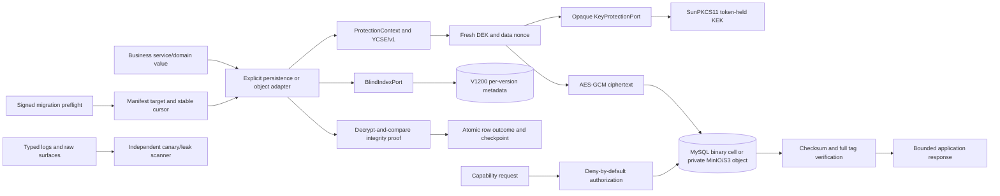

# Design

## Context and constraints

- Phase 03 只负责 storage/key bootstrap，不负责密码哈希、RBAC/reveal、资格业务状态或归档。
- Java 21/Spring Boot/JPA/Flyway/MySQL 8 是现有平台边界；S3 使用 AWS SDK v2；生产 key adapter 使用 Java 21 SunPKCS11。
- `YCSE/v1` 固定最大 overhead 为 145 bytes；V1 `VARBINARY(255)` 的 plaintext 上限为 110 UTF-8 bytes。超过上限的现存值阻断迁移，不能截断或静默 deferral。
- SoftHSM 只证明 PKCS#11 协议与应用 adapter 一致性，不声明物理 HSM 认证。
- Phase 03 无 UI，不创建 Pencil、Playwright、route 或 `data-testid` 合同。

## Scope table

| Rule | Persisted intent | Derived state | Public contract | Compatibility behavior | Explicit exclusion |
| --- | --- | --- | --- | --- | --- |
| Protected database value | YCSE binary envelope and per-version blind-index metadata | envelope/key/context validity and target checkpoint | business service supplies domain value and immutable context only | v1 remains readable; raw-SHA fallback is target-checkpoint gated | global converter, plaintext fallback, legacy DDL |
| Key lifecycle | provider/key reference, purpose, state, checkpoint and sanitized counters | exactly one ACTIVE plus readable prior references | opaque wrap/unwrap/HMAC/health ports | rewrap preserves data ciphertext; retirement waits for zero references | key bytes, PINs, application key deletion |
| Protected object | opaque object/session/capability metadata and private ciphertext object | STAGED/CLAIMED/EXPIRED/ORPHANED/DELETED | staged multipart upload and application-mediated capability access | legacy URL input is explicitly rejected | public URL, raw S3 presign, Phase 6 RBAC completion claim |
| Migration | accepted signed-manifest subject, lease, target state, cursor and aggregate integrity facts | DISCOVERED/BACKFILLED/VERIFIED/CUTOVER/SCRUBBED/COMPLETE | fixed preflight/start/resume/pause/abort/status command | reader mode changes only after verified checkpoints | ad-hoc SQL, plaintext rollback, V1 mutation |
| Safe diagnostics | event category, correlation, hashed locator, status and counts | leak report target union and subject digests | generic stable errors | source/config/API docs move with runtime contract | request bodies, protected values, arbitrary provider text |

## Semantic ownership matrix

| Semantic rule | Single owner | Callers may do | Callers must not do | Primary plans |
| --- | --- | --- | --- | --- |
| Envelope parsing/serialization | `EnvelopeCodec` | persist opaque bytes | inspect offsets or guess legacy format | 03-04 |
| Per-value encryption | `ProtectedFieldCodec` | provide `ProtectionContext` | call JCE or key provider directly | 03-05 |
| KEK/HMAC operations | `KeyProtectionPort` / `BlindIndexPort`, production `SunPkcs11KeyAdapter` | request operation by key reference | obtain key bytes or select test fallback | 03-05 through 03-07 |
| DB protected assignment | explicit message/tenant repository adapters | pass domain value and immutable ID | assign `_encrypted` or raw hash fields directly | 03-08 through 03-10, 03-17 |
| Blind-index lookup/cutover | `BlindIndexLookupService` and migration checkpoint owner | query ordered ACTIVE/RETIRING set | use global raw SHA after COMPLETE | 03-09 through 03-14, 03-20 |
| Object lifecycle/access | `ProtectedObjectService`, capability service and authorization port | upload/read/delete by opaque ID | return bucket/key/public URL or fetch before authorization | 03-15 through 03-17 |
| Migration state | `ProtectedDataMigrationRunner` and repository | invoke fixed command | bypass manifest/checkpoint transaction | 03-12 through 03-14 |
| Key state/rewrap | `KeyLifecycleService` and `EnvelopeRewrapService` | request prepare/activate/rewrap | retire referenced keys or delete token keys | 03-20 through 03-21 |
| Logging/leak proof | `SecurityEventLogger` and leak scanner | emit allowlisted facts | log arbitrary values/throwables | 03-18 through 03-19 |
| API documentation | runtime constants/DTOs plus `core/docs/API.md` and `docs/使用手册.md` | explain accepted endpoints/errors | document legacy URL acceptance or unsupported behavior | 03-17, 03-22 |

## End-to-end data flow

## Data model and migrations

`V1200__create_crypto_storage_metadata.sql` is expand-only and owns only key references/state, per-version blind-index rows, protected object/session/capability metadata, migration run/checkpoint/lease/accepted-manifest state and sanitized events. It does not alter legacy V1 tables and contains no plaintext DEK, KEK, HMAC key, PIN, protected value, raw URL or capability token.

The polymorphic legacy-row binding in blind-index metadata cannot use one physical foreign key. The allowlisted target manifest, same-transaction row-existence check, original-row digest predicate and orphan reconciliation jointly enforce the binding. `key_version` remains constrained to the Phase-owned key-reference registry.

Schema migrations: declared

## State machines

- Key: `PREPARED -> ACTIVE -> DECRYPT_ONLY -> RETIRED`, with `COMPROMISED` as a fail-closed terminal policy state. Activation atomically moves the previous ACTIVE key to DECRYPT_ONLY.
- Blind-index target: `DISCOVERED -> BACKFILLED -> VERIFIED -> CUTOVER -> SCRUBBED -> COMPLETE`. No raw legacy fallback is reachable at COMPLETE.
- Registration object: `STAGED -> CLAIMED` or `STAGED -> EXPIRED/ORPHANED -> DELETED`; failed tenant persistence preserves a deterministic reconciliation path.
- Migration run: preflight accepted subject → leased bounded batch → verified row outcome/checkpoint; pause/abort stops new claims without reverting ciphertext to plaintext.

## API and protocol contracts

- `POST /api/v1/console/tenants/registration-object-sessions` returns opaque session, one-use upload credential and expiry marker.
- `POST /api/v1/console/tenants/registration-object-sessions/{sessionId}/objects/{purpose}` accepts one multipart part named `file` and returns an opaque `pobj_v1_*` ID.
- Tenant registration accepts only session and five purpose-bound object IDs. Legacy URL-shaped fields/values fail with `LEGACY_OBJECT_URL_NOT_ACCEPTED`.
- The fixed migration preflight accepts canonical writer/snapshot manifest paths, detached signatures and exact environment/database/schema/Flyway subject arguments. Exit categories 20 through 26 are stable rejection classes and precede mutable work.
- `core/docs/API.md` and `docs/使用手册.md` must be asserted against runtime constants for routes, headers, purposes, media/size rules, object lifecycle and errors.

## Compatibility contract

| Compatibility seam | Accepted reader/writer set | Removal condition | Failure behavior |
| --- | --- | --- | --- |
| YCSE format | write v1; read v1 | a later version has explicit migration/read support | unknown/malformed version fails as one sanitized category |
| Blind index | metadata ACTIVE+RETIRING union; target-scoped legacy fallback before COMPLETE | target parity, signed writer fence and COMPLETE checkpoint | missing state/orphan/duplicate/fallback-after-complete fails closed |
| Existing V1 cells | in-place representation when capacity and Connector/J binding pass | every reviewed target is resolved and migrated | over-capacity or ambiguous row remains blocking |
| Registration evidence | staged opaque IDs only | no legacy acceptance path exists | raw URL and unknown JSON fail explicitly |
| Mixed deployment writers | only signed, allowlisted, compatible writer set | sequence/digest and cutover proof accepted | stale/unknown/replayed/forged set mutates zero rows |

## Validation ladder

| Layer | Truth owned | Executable boundary | What cannot substitute |
| --- | --- | --- | --- |
| Pure unit | codec bounds, AAD, state transitions, signed manifest parsing, normalization | focused JUnit 5/AssertJ suites | source inspection alone |
| Service/transaction | one semantic owner, no partial save, stable errors | Spring service and transaction tests | controller-only tests |
| Persistence/migration | binary binding, Flyway, constraints, locks, checkpoints, restart | digest-pinned real MySQL and JDBC raw-row assertions | H2 or SQL parsing |
| Key provider | opaque handles, mechanisms, wrap/HMAC, reopen/fault | Java 21 SunPKCS11 with isolated SoftHSM token | Mockito or deterministic adapter |
| Object boundary | private policy, checksum, raw ciphertext, anonymous denial | AWS SDK v2 against digest-pinned MinIO | in-memory map or mock S3 |
| API/docs | DTO/routes/errors/media/object claim parity | MVC tests plus document/runtime constant assertions | documentation review alone |
| Operational/evidence | complete fixed registry, leak sensitivity, exact subject binding | `scripts/verify-phase-03`, exact-four producer/validator and cleanup checks | self-authored PASS JSON |

## Regression matrix

| Dimension | Required cases |
| --- | --- |
| Tenant/resource context | correct tenant, cross-tenant, cross-row, cross-field, missing immutable identity |
| Protected value shape | null policy, empty/unicode, 11-digit mobile, 18-character identity, 110-byte boundary, over-capacity |
| Key state | ACTIVE, DECRYPT_ONLY, RETIRING index, missing, compromised, concurrent activation, premature retirement |
| Migration state | fresh, valid envelope, approved legacy, corrupt magic, ambiguous encoding, restart, duplicate worker, drift, conflict |
| Object state | staged, replaced, claimed, expired, reused, revoked, tampered, orphaned, deleted |
| Registration purpose | required/optional set, media signature mismatch, oversize, wrong session/purpose/draft, partial claim, legacy URL |
| External failure | PKCS#11 outage, MySQL rollback, MinIO split success, manifest forgery/replay, cleanup failure |
| Diagnostics | business exception, unexpected exception, provider failure, CR/LF, token/URL/key/payload canaries |
| Compatibility | pre-backfill, ACTIVE+RETIRING union, cutover, scrub, COMPLETE with fallback unreachable |

## Threat boundaries

| Boundary | Threat | Control | Evidence |
| --- | --- | --- | --- |
| Application ↔ MySQL | DB dump disclosure and ciphertext substitution | per-value envelope, row/tenant/field AAD, raw-row scans | real MySQL persistence/migration suites |
| Application ↔ PKCS#11 | key extraction, alias spoofing, fallback | canonical module/token identity, nonextractable handles, startup fail-close | real SoftHSM production-adapter suite |
| Application ↔ S3 | public/direct access, object tamper, split write | private ciphertext-only port, checksum/tag, operation reconciliation | real MinIO anonymous-denial and fault suite |
| Client ↔ registration API | URL smuggling, purpose/session confusion, token reuse | strict DTO, signature sniffing, staged single claim | MVC plus real composed registration suite |
| Deployment ↔ migration | stale/unknown writer, forged snapshot, replay | canonical Ed25519 manifests, fingerprint/subject/sequence binding | fixed command exit matrix plus zero-update JDBC assertions |
| Runtime ↔ logs/evidence | protected data or provider detail leakage | allowlisted structured logging, output defense, independent target-union scanner | captured-log and cross-boundary canary suites |

## Failure, rollback and recovery

- A failed protected write persists neither plaintext nor partial metadata.
- Rotation interruption retains old decrypt capability and resumes from the same verified checkpoint.
- Migration rollback means transaction rollback, forward repair, or restoration from an admitted encrypted snapshot; it never restores protected plaintext.
- Object-store success with metadata failure is reconciled by operation ID; failed tenant claim returns to a deterministic staged reconciliation state.
- Missing real-service prerequisites and cleanup failures remain open TODOs and cannot be relabeled as deterministic proof.

## Alternatives rejected

- Direct configuration-held AES key, global JPA converter, unversioned ciphertext and raw mobile SHA-256.
- Raw S3/public/presigned object delivery, always-allow production authorization, or server-side fetch of legacy URLs.
- Editing V1, using V2 instead of the registered V1200 range, combining expand/backfill/contract in startup, or restoring plaintext as rollback.
- Treating deterministic adapters, H2, mocks, source admission or document text as real MySQL/PKCS#11/S3 evidence.
